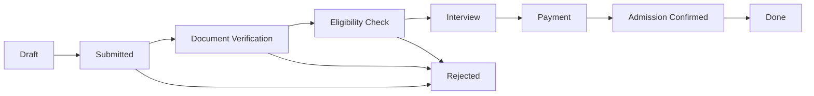

# Admission Module Improvement Plan

## Executive Summary
This document outlines a comprehensive plan to improve the `openeducat_admission` module by enhancing functionality, user experience, integration capabilities, and documentation. The plan focuses on modernizing the admission workflow, improving portal integration, and creating comprehensive technical documentation.

---

## Table of Contents
1. [Current State Analysis](#current-state-analysis)
2. [Improvement Areas](#improvement-areas)
3. [Phase 1: Core Functionality Enhancements](#phase-1-core-functionality-enhancements)
4. [Phase 2: Portal Integration & User Experience](#phase-2-portal-integration--user-experience)
5. [Phase 3: Reporting & Analytics](#phase-3-reporting--analytics)
6. [Phase 4: Integration & Automation](#phase-4-integration--automation)
7. [Phase 5: Documentation Creation](#phase-5-documentation-creation)
8. [Implementation Timeline](#implementation-timeline)
9. [Success Metrics](#success-metrics)

---

## Current State Analysis

### Existing Features
- **Admission Management**: Basic admission application processing
- **Admission Register**: Campaign-based admission registration
- **Student Enrollment**: Conversion of admission to student records
- **Fee Management**: Integration with fees module
- **State Workflow**: Draft → Submit → Confirm → Admission → Done
- **Multi-base Support**: Program-based and Course-based admissions
- **Reporting**: Basic admission analysis reports

### Current Dependencies
- `openeducat_core`: Core educational functionality
- `openeducat_fees`: Fee management and payment processing

### Identified Gaps
1. **No Portal Integration**: Students cannot apply online through portal
2. **Limited Document Management**: No document upload/verification system
3. **Manual Workflow**: Limited automation in admission processing
4. **Basic Validation**: Missing advanced eligibility checks
5. **No Communication System**: No automated email/SMS notifications
6. **Limited Reporting**: Basic analytics without dashboards
7. **No Documentation**: Missing technical and user documentation
8. **No Online Payment**: No integration with payment gateways
9. **Limited Multi-language**: Basic translation support
10. **No Interview Scheduling**: Missing interview/test management

---

## Improvement Areas

### Priority Matrix

| Priority | Area | Impact | Effort |
|----------|------|--------|--------|
| **High** | Portal Integration | High | Medium |
| **High** | Document Management | High | Low |
| **High** | Documentation Creation | High | Low |
| **Medium** | Automated Notifications | Medium | Medium |
| **Medium** | Enhanced Reporting | Medium | Medium |
| **Medium** | Online Payment Integration | High | High |
| **Low** | Interview Management | Medium | High |
| **Low** | AI-based Eligibility | Low | High |

---

## Phase 1: Core Functionality Enhancements

### 1.1 Enhanced Admission Form
**Objective**: Improve data collection and validation

#### Tasks:
- [ ] Add document upload fields (certificates, ID, photos)
- [ ] Implement multi-step form wizard
- [ ] Add dynamic field visibility based on program/course
- [ ] Enhance validation rules (age, qualification, etc.)
- [ ] Add emergency contact information
- [ ] Implement guardian/parent information section
- [ ] Add previous education history (multiple entries)
- [ ] Include language proficiency fields
- [ ] Add special needs/accommodation fields

#### Technical Implementation:
```python
# New fields to add to op.admission model
document_ids = fields.One2many('op.admission.document', 'admission_id', 'Documents')
emergency_contact_ids = fields.One2many('op.admission.emergency.contact', 'admission_id')
education_history_ids = fields.One2many('op.admission.education.history', 'admission_id')
guardian_ids = fields.One2many('op.admission.guardian', 'admission_id', 'Guardians')
special_needs = fields.Text('Special Needs/Accommodations')
language_proficiency_ids = fields.Many2many('op.language', string='Languages')
```

### 1.2 Document Management System
**Objective**: Enable document upload, verification, and tracking

#### Tasks:
- [ ] Create `op.admission.document` model
- [ ] Define document types (ID, certificates, photos, etc.)
- [ ] Implement document verification workflow
- [ ] Add document status tracking (pending, verified, rejected)
- [ ] Enable document preview in form view
- [ ] Add document expiry date tracking
- [ ] Implement document version control
- [ ] Add bulk document download feature

#### New Models:
```python
class OpAdmissionDocument(models.Model):
    _name = 'op.admission.document'
    _description = 'Admission Documents'
    
    admission_id = fields.Many2one('op.admission', required=True)
    document_type_id = fields.Many2one('op.document.type', required=True)
    document = fields.Binary('Document', required=True)
    filename = fields.Char('Filename')
    state = fields.Selection([
        ('pending', 'Pending'),
        ('verified', 'Verified'),
        ('rejected', 'Rejected')
    ], default='pending')
    verified_by = fields.Many2one('res.users', 'Verified By')
    verified_date = fields.Datetime('Verification Date')
    notes = fields.Text('Verification Notes')
```

### 1.3 Enhanced Workflow States
**Objective**: Add more granular state management

#### New States to Add:
- `document_verification`: Document Verification
- `eligibility_check`: Eligibility Check
- `interview_scheduled`: Interview Scheduled
- `interview_completed`: Interview Completed
- `payment_pending`: Payment Pending
- `payment_confirmed`: Payment Confirmed

#### State Transition Rules:
```
draft → submit → document_verification → eligibility_check → 
interview_scheduled → interview_completed → payment_pending → 
payment_confirmed → admission → done
```

### 1.4 Automated Eligibility Checking
**Objective**: Automate admission eligibility validation

#### Tasks:
- [ ] Create eligibility criteria configuration
- [ ] Implement automatic eligibility scoring
- [ ] Add eligibility report generation
- [ ] Enable manual override with justification
- [ ] Add eligibility history tracking

---

## Phase 2: Portal Integration & User Experience

### 2.1 Student Portal - Online Application
**Objective**: Enable students to apply online through Odoo portal

#### Tasks:
- [ ] Create portal controller for admission application
- [ ] Design responsive application form template
- [ ] Implement multi-step application wizard
- [ ] Add document upload functionality in portal
- [ ] Enable application draft saving
- [ ] Add application preview before submission
- [ ] Implement application tracking dashboard
- [ ] Add application status notifications

#### Technical Implementation:
```python
# controllers/portal.py
from odoo import http
from odoo.addons.portal.controllers.portal import CustomerPortal

class AdmissionPortal(CustomerPortal):
    
    @http.route(['/my/admissions', '/my/admissions/page/<int:page>'], 
                type='http', auth="user", website=True)
    def portal_my_admissions(self, page=1, **kw):
        """List all admissions for current user"""
        pass
    
    @http.route(['/my/admission/apply'], type='http', auth="user", website=True)
    def portal_admission_apply(self, **kw):
        """Create new admission application"""
        pass
    
    @http.route(['/my/admission/<int:admission_id>'], 
                type='http', auth="user", website=True)
    def portal_admission_detail(self, admission_id, **kw):
        """View admission details"""
        pass
```

#### Portal Features:
1. **Application Dashboard**
   - View all submitted applications
   - Application status tracking
   - Document upload status
   - Payment status
   - Next steps/actions required

2. **Online Application Form**
   - Personal information
   - Contact details
   - Educational background
   - Document uploads
   - Program/course selection
   - Preview and submit

3. **Application Tracking**
   - Real-time status updates
   - Timeline view of application progress
   - Notification center
   - Communication history

4. **Document Management**
   - Upload required documents
   - View uploaded documents
   - Re-upload rejected documents
   - Download admission letter

### 2.2 Portal Templates
**Objective**: Create user-friendly portal templates

#### Templates to Create:
- [ ] `portal_my_admissions.xml` - Admission list view
- [ ] `portal_admission_apply.xml` - Application form
- [ ] `portal_admission_detail.xml` - Application details
- [ ] `portal_admission_documents.xml` - Document management
- [ ] `portal_admission_payment.xml` - Payment processing

### 2.3 Portal Security & Access Control
**Objective**: Ensure secure portal access

#### Tasks:
- [ ] Implement record rules for portal users
- [ ] Add field-level security
- [ ] Enable data privacy controls
- [ ] Add audit logging for portal actions
- [ ] Implement rate limiting for submissions

---

## Phase 3: Reporting & Analytics

### 3.1 Enhanced Dashboards
**Objective**: Provide comprehensive admission analytics

#### Dashboard Components:
- [ ] Real-time admission statistics
- [ ] Application funnel visualization
- [ ] Conversion rate tracking
- [ ] Geographic distribution map
- [ ] Program/course popularity charts
- [ ] Time-series analysis
- [ ] Demographic analytics
- [ ] Source tracking (online, offline, referral)

### 3.2 Custom Reports
**Objective**: Generate detailed admission reports

#### Reports to Create:
- [ ] Daily admission summary
- [ ] Weekly admission pipeline report
- [ ] Monthly admission analysis
- [ ] Program-wise admission report
- [ ] Document verification status report
- [ ] Payment collection report
- [ ] Admission forecasting report
- [ ] Rejection analysis report

### 3.3 Data Export & Integration
**Objective**: Enable data export and external integration

#### Tasks:
- [ ] Add Excel export functionality
- [ ] Implement PDF report generation
- [ ] Create API endpoints for external systems
- [ ] Add scheduled report email delivery
- [ ] Enable custom report builder

---

## Phase 4: Integration & Automation

### 4.1 Communication System
**Objective**: Automate communication with applicants

#### Tasks:
- [ ] Create email templates for each state
- [ ] Implement SMS notifications (optional)
- [ ] Add WhatsApp integration (optional)
- [ ] Create automated email sequences
- [ ] Add reminder system for pending actions
- [ ] Implement bulk communication tool

#### Email Templates to Create:
1. Application received confirmation
2. Document verification request
3. Document approval/rejection notification
4. Interview invitation
5. Admission offer letter
6. Payment reminder
7. Enrollment confirmation
8. Welcome email

### 4.2 Payment Gateway Integration
**Objective**: Enable online payment for admission fees

#### Tasks:
- [ ] Integrate payment provider (Stripe/PayPal/local)
- [ ] Create payment processing workflow
- [ ] Add payment status tracking
- [ ] Implement payment receipt generation
- [ ] Add refund management
- [ ] Enable partial payment support

### 4.3 Third-party Integrations
**Objective**: Connect with external systems

#### Potential Integrations:
- [ ] SMS gateway integration
- [ ] Email marketing platform (Mailchimp, SendGrid)
- [ ] CRM system integration
- [ ] Government ID verification APIs
- [ ] Academic credential verification services
- [ ] Calendar integration (Google Calendar, Outlook)

### 4.4 Workflow Automation
**Objective**: Reduce manual intervention

#### Automation Rules:
- [ ] Auto-assign admission to reviewers
- [ ] Auto-verify documents using AI/OCR
- [ ] Auto-calculate eligibility scores
- [ ] Auto-send notifications on state changes
- [ ] Auto-create student record on admission
- [ ] Auto-generate admission number
- [ ] Auto-archive old applications

---

## Phase 5: Documentation Creation

### 5.1 Documentation Structure
**Objective**: Create comprehensive documentation in `static/doc/` folder

#### Documentation Folder Structure:
```
openeducat_admission/
└── static/
    └── doc/
        ├── README.md
        ├── 01_OVERVIEW.md
        ├── 02_ARCHITECTURE.md
        ├── 03_MODELS.md
        ├── 04_WORKFLOWS.md
        ├── 05_PORTAL_INTEGRATION.md
        ├── 06_MODULE_RELATIONSHIPS.md
        ├── 07_VIEWS_AND_UI.md
        ├── 08_SECURITY.md
        ├── 09_REPORTS.md
        ├── 10_API_REFERENCE.md
        ├── 11_CUSTOMIZATION_GUIDE.md
        ├── 12_TROUBLESHOOTING.md
        ├── diagrams/
        │   ├── admission_workflow.png
        │   ├── module_dependencies.png
        │   ├── portal_flow.png
        │   ├── data_model.png
        │   └── integration_architecture.png
        └── screenshots/
            ├── admission_form.png
            ├── portal_application.png
            ├── dashboard.png
            └── reports.png
```

### 5.2 Documentation Content

#### 5.2.1 README.md
**Purpose**: Quick start guide and module overview

**Content**:
- Module description
- Key features
- Installation instructions
- Quick start guide
- Links to detailed documentation
- Support information

#### 5.2.2 01_OVERVIEW.md
**Purpose**: High-level module overview

**Content**:
- Module purpose and objectives
- Business use cases
- Key features and capabilities
- Target users (admin, staff, students)
- Module version history
- Roadmap and future enhancements

#### 5.2.3 02_ARCHITECTURE.md
**Purpose**: Technical architecture documentation

**Content**:
- Module structure overview
- Technology stack
- Design patterns used
- Database schema overview
- Integration points
- Performance considerations
- Scalability guidelines

#### 5.2.4 03_MODELS.md
**Purpose**: Detailed model documentation

**Content**:
- **op.admission** model
  - Field descriptions
  - Computed fields logic
  - Constraints and validations
  - Methods and their purposes
  - Inheritance chain
  
- **op.admission.register** model
  - Field descriptions
  - State management
  - Related models
  
- **Supporting models**
  - op.admission.document
  - op.admission.fees.line
  - op.admission.emergency.contact
  - op.admission.education.history

- **Model relationships diagram**
- **Field reference table**

#### 5.2.5 04_WORKFLOWS.md
**Purpose**: Document all workflows and state transitions

**Content**:
- **Admission Workflow**
  - State diagram
  - State descriptions
  - Transition conditions
  - User actions per state
  - Automated actions
  
- **Document Verification Workflow**
- **Payment Workflow**
- **Enrollment Workflow**
- **Rejection/Cancellation Workflow**

- **Workflow diagrams** (using Mermaid or PlantUML)


#### 5.2.6 05_PORTAL_INTEGRATION.md
**Purpose**: Document portal functionality and integration

**Content**:
- **Portal Overview**
  - Portal access and authentication
  - User roles and permissions
  - Portal menu structure
  
- **Online Application Process**
  - Step-by-step application guide
  - Form fields and validation
  - Document upload process
  - Application submission
  
- **Portal Features**
  - Application dashboard
  - Status tracking
  - Document management
  - Payment processing
  - Communication center
  
- **Portal Controllers**
  - Route definitions
  - Controller methods
  - Template rendering
  - Security considerations
  
- **Portal Templates**
  - Template structure
  - QWeb syntax used
  - CSS/JS assets
  - Responsive design
  
- **Portal Customization**
  - Extending portal views
  - Adding custom fields
  - Branding and theming

#### 5.2.7 06_MODULE_RELATIONSHIPS.md
**Purpose**: Document relationships with other Odoo modules

**Content**:
- **Core Dependencies**
  - **openeducat_core**
    - Models used (op.student, op.course, op.batch, op.program)
    - Inherited functionality
    - Data flow between modules
    - Integration points
  
  - **openeducat_fees**
    - Fee calculation logic
    - Payment processing
    - Fee terms integration
    - Invoice generation
  
- **Optional Integrations**
  - **openeducat_exam**: Link admission to entrance exams
  - **openeducat_library**: Auto-create library card
  - **openeducat_timetable**: Assign to classes
  - **openeducat_parent**: Parent portal access
  
- **Odoo Standard Modules**
  - **base**: Partner, user management
  - **mail**: Chatter, notifications
  - **portal**: Portal access
  - **account**: Invoice generation
  - **website**: Online forms (future)
  
- **Module Dependency Diagram**
```
┌─────────────────────────┐
│   openeducat_admission  │
└───────────┬─────────────┘
            │
    ┌───────┴───────┐
    │               │
┌───▼────────┐  ┌──▼──────────┐
│ openeducat │  │ openeducat  │
│   _core    │  │   _fees     │
└────────────┘  └─────────────┘
```

- **Data Flow Diagrams**
  - Admission to Student conversion
  - Fee calculation flow
  - Document verification flow
  - Portal to backend data flow

#### 5.2.8 07_VIEWS_AND_UI.md
**Purpose**: Document views and user interface

**Content**:
- **Form Views**
  - Admission form layout
  - Field grouping and notebooks
  - Smart buttons and actions
  - Status bar and state buttons
  
- **List Views**
  - Column configuration
  - Filters and groups
  - Search domains
  - Color coding
  
- **Kanban Views**
  - Card design
  - State-based kanban
  - Quick actions
  
- **Calendar/Pivot Views**
- **Dashboard Views**
- **Portal Views**

- **View Inheritance**
  - Extended views
  - XPath modifications
  
- **UI/UX Best Practices**
  - Field placement guidelines
  - Validation messages
  - User feedback mechanisms

#### 5.2.9 08_SECURITY.md
**Purpose**: Document security implementation

**Content**:
- **Access Rights (ir.model.access.csv)**
  - User groups
  - Model permissions (create, read, write, delete)
  - Group assignments
  
- **Record Rules**
  - Multi-company rules
  - User-specific rules
  - Portal user restrictions
  
- **Field-level Security**
  - groups attribute
  - Readonly conditions
  
- **Portal Security**
  - Portal access rules
  - Data isolation
  - XSS/CSRF protection
  
- **Security Best Practices**
  - Input validation
  - SQL injection prevention
  - File upload security
  - Authentication and authorization

#### 5.2.10 09_REPORTS.md
**Purpose**: Document reporting capabilities

**Content**:
- **QWeb Reports**
  - Admission analysis report
  - Report templates
  - Report actions
  
- **Dashboard Reports**
  - Admission statistics
  - Graphical representations
  
- **Excel Reports**
  - Export functionality
  - Template usage
  
- **Custom Report Development**
  - Creating new reports
  - Report wizard usage
  - Data aggregation techniques

#### 5.2.11 10_API_REFERENCE.md
**Purpose**: Document public APIs and methods

**Content**:
- **Public Methods**
  - Method signatures
  - Parameters and return values
  - Usage examples
  - Error handling
  
- **Computed Fields**
  - Computation logic
  - Dependencies
  
- **Onchange Methods**
  - Trigger conditions
  - Side effects
  
- **Constraints**
  - Validation rules
  - Error messages
  
- **REST API Endpoints** (if implemented)
  - Endpoint URLs
  - Request/response formats
  - Authentication requirements

#### 5.2.12 11_CUSTOMIZATION_GUIDE.md
**Purpose**: Guide for customizing the module

**Content**:
- **Extending Models**
  - Inheritance patterns
  - Adding custom fields
  - Overriding methods
  
- **Customizing Views**
  - View inheritance
  - Adding custom widgets
  - Modifying layouts
  
- **Custom Workflows**
  - Adding new states
  - Custom validation rules
  - Automated actions
  
- **Theming and Branding**
  - Portal customization
  - Email template branding
  - Report customization
  
- **Integration Examples**
  - Custom payment gateway
  - External API integration
  - Webhook implementation

#### 5.2.13 12_TROUBLESHOOTING.md
**Purpose**: Common issues and solutions

**Content**:
- **Common Issues**
  - Installation problems
  - Configuration errors
  - Portal access issues
  - Payment gateway errors
  
- **Error Messages**
  - Error code reference
  - Root cause analysis
  - Resolution steps
  
- **Performance Optimization**
  - Query optimization
  - Caching strategies
  - Large data handling
  
- **Debugging Tips**
  - Logging configuration
  - Debug mode usage
  - Common pitfalls
  
- **FAQ**
  - Frequently asked questions
  - Best practices
  
- **Support Resources**
  - Community forums
  - Bug reporting
  - Feature requests

### 5.3 Diagram Creation
**Objective**: Create visual documentation

#### Diagrams to Create:

1. **admission_workflow.png**
   - Complete admission state workflow
   - Decision points
   - User actions
   - Automated processes

2. **module_dependencies.png**
   - Module dependency tree
   - Integration points
   - Data flow between modules

3. **portal_flow.png**
   - Student portal user journey
   - Application submission flow
   - Document upload process
   - Payment flow

4. **data_model.png**
   - Entity-relationship diagram
   - Model relationships
   - Key fields

5. **integration_architecture.png**
   - System architecture
   - External integrations
   - API endpoints
   - Communication channels

#### Tools for Diagram Creation:
- **Mermaid**: For workflow and sequence diagrams (embedded in markdown)
- **Draw.io**: For complex architecture diagrams
- **PlantUML**: For UML diagrams
- **Lucidchart**: For professional diagrams

### 5.4 Code Documentation
**Objective**: Improve inline code documentation

#### Tasks:
- [ ] Add comprehensive docstrings to all methods
- [ ] Document complex logic with inline comments
- [ ] Add type hints (Python 3.5+)
- [ ] Create code examples for common use cases
- [ ] Document API contracts

#### Docstring Format:
```python
def enroll_student(self):
    """
    Enroll admitted student and create student record.
    
    This method performs the following operations:
    1. Validates admission register capacity
    2. Creates or updates student record
    3. Generates fee details based on fee terms
    4. Creates subject registration
    5. Updates admission state to 'done'
    
    Raises:
        ValidationError: If admission register is at max capacity
        UserError: If required fields are missing
    
    Returns:
        bool: True if enrollment successful
        
    Example:
        >>> admission = self.env['op.admission'].browse(1)
        >>> admission.enroll_student()
        True
    """
    pass
```

### 5.5 User Documentation
**Objective**: Create end-user guides

#### User Guides to Create:
- [ ] **Admin Guide**: System configuration and management
- [ ] **Staff Guide**: Processing applications and admissions
- [ ] **Student Guide**: Applying through portal
- [ ] **Video Tutorials**: Screen recordings for common tasks
- [ ] **Quick Reference Cards**: One-page guides for specific tasks

### 5.6 Developer Documentation
**Objective**: Help developers extend the module

#### Developer Resources:
- [ ] Development environment setup
- [ ] Module structure explanation
- [ ] Coding standards and conventions
- [ ] Testing guidelines
- [ ] Contribution guidelines
- [ ] Git workflow
- [ ] Release process

---

## Implementation Timeline

### Phase 1: Core Enhancements (Weeks 1-3)
- Week 1: Enhanced admission form and document management
- Week 2: Workflow improvements and eligibility checking
- Week 3: Testing and refinement

### Phase 2: Portal Integration (Weeks 4-6)
- Week 4: Portal controllers and backend logic
- Week 5: Portal templates and UI
- Week 6: Security and testing

### Phase 3: Reporting & Analytics (Weeks 7-8)
- Week 7: Dashboard development
- Week 8: Custom reports and exports

### Phase 4: Integration & Automation (Weeks 9-10)
- Week 9: Communication system and email templates
- Week 10: Payment integration and workflow automation

### Phase 5: Documentation (Weeks 11-12)
- Week 11: Technical documentation and diagrams
- Week 12: User guides and final review

---

## Success Metrics

### Quantitative Metrics
- **Application Processing Time**: Reduce by 50%
- **Manual Intervention**: Reduce by 60%
- **Online Applications**: Increase to 80% of total
- **Document Verification Time**: Reduce by 40%
- **User Satisfaction**: Achieve 4.5/5 rating
- **Portal Adoption**: 90% of applicants use portal

### Qualitative Metrics
- Improved user experience feedback
- Reduced support tickets
- Positive staff feedback
- Better data accuracy
- Enhanced reporting capabilities

---

## Risk Assessment

### Technical Risks
| Risk | Impact | Probability | Mitigation |
|------|--------|-------------|------------|
| Portal performance issues | High | Medium | Load testing, caching |
| Payment gateway integration | High | Medium | Thorough testing, fallback options |
| Data migration issues | Medium | Low | Backup strategy, staged rollout |
| Security vulnerabilities | High | Low | Security audit, penetration testing |

### Operational Risks
| Risk | Impact | Probability | Mitigation |
|------|--------|-------------|------------|
| User resistance to change | Medium | Medium | Training, change management |
| Insufficient training | Medium | Medium | Comprehensive training program |
| Resource constraints | High | Low | Phased implementation |

---

## Resource Requirements

### Development Team
- 1 Senior Odoo Developer (full-time)
- 1 Frontend Developer (part-time)
- 1 QA Engineer (part-time)
- 1 Technical Writer (part-time)

### Infrastructure
- Development server
- Staging server
- Production server
- Payment gateway sandbox
- Documentation hosting

### Tools & Services
- Version control (Git)
- Project management tool
- Documentation platform
- Testing tools
- Monitoring tools

---

## Maintenance Plan

### Regular Maintenance
- Weekly code reviews
- Monthly security updates
- Quarterly feature updates
- Annual major version upgrade

### Support Structure
- Level 1: User support (portal, basic issues)
- Level 2: Technical support (configuration, integration)
- Level 3: Development support (bugs, enhancements)

### Documentation Updates
- Update documentation with each release
- Maintain changelog
- Keep API documentation current
- Regular review of user guides

---

## Conclusion

This comprehensive improvement plan will transform the admission module into a modern, efficient, and user-friendly system. The phased approach ensures manageable implementation while delivering value at each stage. The extensive documentation will ensure long-term maintainability and ease of customization.

### Next Steps
1. Review and approve this plan
2. Allocate resources and budget
3. Set up development environment
4. Begin Phase 1 implementation
5. Create project tracking board
6. Schedule regular review meetings

---

## Appendices

### Appendix A: Glossary
- **Admission Register**: Campaign for collecting applications
- **Portal User**: Student accessing system through web portal
- **Eligibility Check**: Automated validation of admission criteria
- **Document Verification**: Process of validating uploaded documents

### Appendix B: References
- Odoo 18 Documentation
- OpenEduCat Documentation
- Web Accessibility Guidelines
- Security Best Practices

### Appendix C: Change Log
| Version | Date | Author | Changes |
|---------|------|--------|---------|
| 1.0 | 2025-11-02 | System | Initial plan creation |

---

**Document Version**: 1.0  
**Last Updated**: November 2, 2025  
**Status**: Draft  
**Approved By**: Pending

