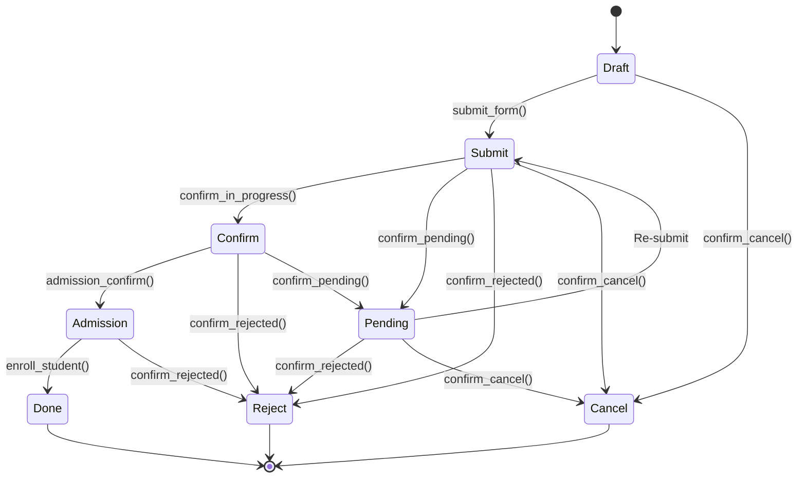
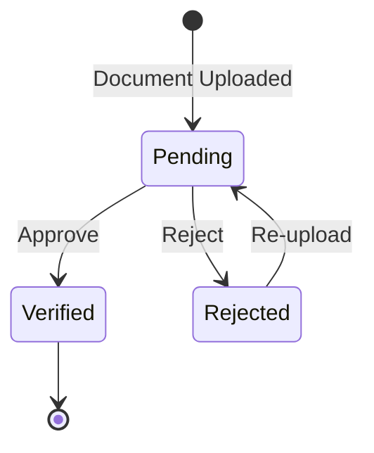
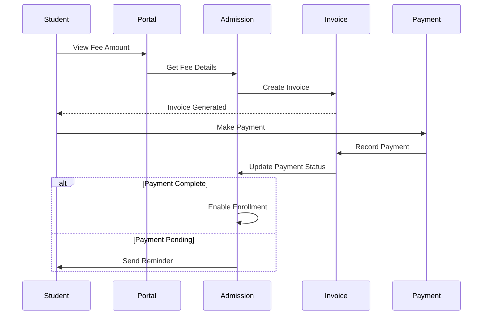
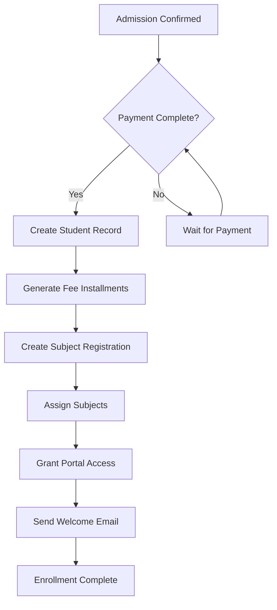

# Admission Workflows Documentation

## Overview

This document provides detailed information about all workflows in the OpenEduCat Admission module, including state transitions, business rules, automated actions, and user interactions at each stage of the admission process.

---

## Table of Contents

1. [Main Admission Workflow](#main-admission-workflow)
2. [State Definitions](#state-definitions)
3. [State Transition Rules](#state-transition-rules)
4. [Workflow Actions](#workflow-actions)
5. [Document Verification Workflow](#document-verification-workflow)
6. [Payment Workflow](#payment-workflow)
7. [Enrollment Workflow](#enrollment-workflow)
8. [Rejection & Cancellation Workflow](#rejection--cancellation-workflow)
9. [Automated Actions](#automated-actions)
10. [Workflow Customization](#workflow-customization)

---

## Main Admission Workflow

### Complete Workflow Diagram



### Workflow States Overview

| State | Code | Color | Description | User Role |
|-------|------|-------|-------------|-----------|
| **Draft** | `draft` | 🔵 Blue | Initial application state | Applicant/Staff |
| **Submitted** | `submit` | 🟣 Purple | Application submitted for review | Applicant |
| **Confirmed** | `confirm` | 🟡 Yellow | Application approved, pending admission | Admission Officer |
| **Admission** | `admission` | 🟢 Green | Admission confirmed, ready for enrollment | Admission Manager |
| **Done** | `done` | ✅ Green | Student enrolled successfully | System |
| **Rejected** | `reject` | 🔴 Red | Application rejected | Admission Officer |
| **Pending** | `pending` | 🟠 Orange | Additional information required | Admission Officer |
| **Cancelled** | `cancel` | ⚫ Gray | Application cancelled | Applicant/Staff |

---

## State Definitions

### 1. Draft State

**Code**: `draft`  
**Default**: Yes  
**Description**: Initial state when admission application is created

#### Characteristics:
- All fields are editable
- Application number not yet assigned
- No validation constraints applied
- Can be deleted

#### User Actions:
- ✏️ Edit all fields
- 📤 Submit application
- ❌ Cancel application

#### System Actions:
- None (manual state)

#### Portal View:
- Applicant can edit all information
- "Submit Application" button visible
- "Save Draft" button available

#### Business Rules:
```python
@api.constrains('name')
def create_sequence(self):
    if not self.application_number:
        self.application_number = self.env['ir.sequence'].next_by_code('op.admission')
```

---

### 2. Submitted State

**Code**: `submit`  
**Description**: Application submitted and awaiting review

#### Characteristics:
- Application number assigned
- Most fields become readonly
- Under review by admission staff
- Email notification sent to applicant

#### User Actions:
- 👁️ View application
- 📄 Upload documents
- ❌ Cancel application (with reason)

#### Staff Actions:
- ✅ Confirm application → `confirm`
- ⏸️ Mark as pending → `pending`
- ❌ Reject application → `reject`
- 🔙 Move to draft → `draft`

#### System Actions:
- Send confirmation email
- Notify admission officers
- Start document verification process

#### Validation:
```python
@api.constrains('register_id', 'application_date')
def _check_admission_register(self):
    start_date = fields.Date.from_string(self.register_id.start_date)
    end_date = fields.Date.from_string(self.register_id.end_date)
    application_date = fields.Date.from_string(self.application_date)
    if application_date < start_date or application_date > end_date:
        raise ValidationError("Application Date should be between Start Date & End Date")
```

---

### 3. Confirmed State

**Code**: `confirm`  
**Description**: Application reviewed and confirmed, awaiting final admission approval

#### Characteristics:
- Documents verified
- Eligibility confirmed
- Awaiting admission manager approval
- Fee structure assigned

#### User Actions:
- 👁️ View application status
- 💬 Communicate with staff

#### Staff Actions:
- ✅ Confirm admission → `admission`
- ⏸️ Mark as pending → `pending`
- ❌ Reject → `reject`

#### System Actions:
- Calculate fees
- Assign fee terms
- Prepare enrollment data

#### Business Logic:
```python
def confirm_in_progress(self):
    for record in self:
        # Validate all required documents uploaded
        if not record.document_ids:
            raise ValidationError("Please upload required documents")
        
        # Check eligibility
        if not record._check_eligibility():
            raise ValidationError("Eligibility criteria not met")
        
        record.state = 'confirm'
```

---

### 4. Admission State

**Code**: `admission`  
**Description**: Admission confirmed, ready for student enrollment

#### Characteristics:
- Final admission approval granted
- Admission letter can be generated
- Payment processing initiated
- Ready for enrollment

#### User Actions:
- 📥 Download admission letter
- 💳 Make payment
- 📋 View enrollment details

#### Staff Actions:
- ✅ Enroll student → `done`
- 💰 Process payment
- ❌ Reject (rare, with justification)

#### System Actions:
- Generate admission letter
- Create invoice (if configured)
- Send admission confirmation email

#### Method:
```python
def admission_confirm(self):
    self.state = 'admission'
    # Generate admission letter
    # Send confirmation email
```

---

### 5. Done State

**Code**: `done`  
**Description**: Student successfully enrolled

#### Characteristics:
- Student record created
- Fee details generated
- Subject registration created
- Portal access granted
- All fields readonly

#### User Actions:
- 👁️ View student record
- 📥 Download enrollment documents
- 🔗 Access student portal

#### Staff Actions:
- 👁️ View student record
- 📊 View enrollment details

#### System Actions:
- Create `op.student` record
- Generate fee installments
- Create subject registration
- Grant portal access
- Send welcome email

#### Enrollment Logic:
```python
def enroll_student(self):
    # Check capacity
    if self.register_id.max_count:
        total_admission = self.search_count([
            ('register_id', '=', self.register_id.id),
            ('state', '=', 'done')
        ])
        if not total_admission < self.register_id.max_count:
            raise ValidationError('Max Admission Reached')
    
    # Create student
    if not self.student_id:
        vals = self.get_student_vals()
        self.student_id = self.env['op.student'].create(vals)
    
    # Create fee details
    if self.fees_term_id.fees_terms in ['fixed_days', 'fixed_date']:
        self._create_fee_details()
    
    # Create subject registration
    reg_id = self.env['op.subject.registration'].create({
        'student_id': self.student_id.id,
        'batch_id': self.batch_id.id,
        'course_id': self.course_id.id,
    })
    reg_id.get_subjects()
    
    # Update state
    self.write({
        'nbr': 1,
        'state': 'done',
        'admission_date': fields.Date.today(),
        'is_student': True,
    })
```

---

### 6. Rejected State

**Code**: `reject`  
**Description**: Application rejected

#### Characteristics:
- Application not approved
- Rejection reason documented
- No further processing
- Archived

#### User Actions:
- 👁️ View rejection reason
- 📧 Contact admission office

#### Staff Actions:
- 📝 Add rejection notes
- 📧 Send rejection notification

#### System Actions:
- Send rejection email
- Archive application
- Update statistics

#### Method:
```python
def confirm_rejected(self):
    self.state = 'reject'
    # Send rejection email with reason
    # Log rejection in chatter
```

---

### 7. Pending State

**Code**: `pending`  
**Description**: Additional information or action required

#### Characteristics:
- Temporary hold state
- Awaiting applicant response
- Can return to submitted state
- Reason for pending documented

#### User Actions:
- 📤 Submit additional information
- 📄 Upload missing documents
- 📧 Contact admission office

#### Staff Actions:
- 📝 Add pending reason
- 🔙 Move back to submitted
- ❌ Reject if no response

#### System Actions:
- Send notification to applicant
- Set reminder for follow-up
- Track pending duration

#### Method:
```python
def confirm_pending(self):
    self.state = 'pending'
    # Send email requesting additional info
    # Create activity for follow-up
```

---

### 8. Cancelled State

**Code**: `cancel`  
**Description**: Application cancelled by applicant or staff

#### Characteristics:
- Application withdrawn
- Cancellation reason documented
- Fee refund processed (if applicable)
- Archived

#### User Actions:
- 👁️ View cancellation details

#### Staff Actions:
- 📝 Document cancellation reason
- 💰 Process refund (if applicable)

#### System Actions:
- Cancel fee details
- Send cancellation confirmation
- Update statistics

#### Method:
```python
def confirm_cancel(self):
    self.state = 'cancel'
    if self.is_student and self.student_id.fees_detail_ids:
        self.student_id.fees_detail_ids.state = 'cancel'
    # Send cancellation email
```

---

## State Transition Rules

### Transition Matrix

| From State | To State | Method | Required Role | Conditions |
|-----------|----------|--------|---------------|------------|
| Draft | Submit | `submit_form()` | Applicant/Staff | Form complete |
| Draft | Cancel | `confirm_cancel()` | Applicant/Staff | Any time |
| Submit | Confirm | `confirm_in_progress()` | Admission Officer | Documents verified |
| Submit | Pending | `confirm_pending()` | Admission Officer | Info needed |
| Submit | Reject | `confirm_rejected()` | Admission Officer | Not eligible |
| Submit | Draft | `confirm_to_draft()` | Admission Officer | Corrections needed |
| Confirm | Admission | `admission_confirm()` | Admission Manager | Approved |
| Confirm | Pending | `confirm_pending()` | Admission Officer | Additional check |
| Confirm | Reject | `confirm_rejected()` | Admission Manager | Final rejection |
| Admission | Done | `enroll_student()` | Admission Manager | Payment confirmed |
| Pending | Submit | Re-submit | Applicant | Info provided |
| Pending | Reject | `confirm_rejected()` | Admission Officer | No response |

### Transition Constraints

```python
# Cannot move to Done without payment
@api.constrains('state')
def _check_payment_before_enrollment(self):
    if self.state == 'done' and self.fees > 0:
        if not self._is_payment_received():
            raise ValidationError("Payment required before enrollment")

# Cannot reject after enrollment
@api.constrains('state')
def _check_reject_after_enrollment(self):
    if self.state == 'reject' and self._origin.state == 'done':
        raise ValidationError("Cannot reject enrolled student")
```

---

## Workflow Actions

### Button Actions in Form View

```xml
<header>
    <button name="submit_form" string="Submit" 
            type="object" class="oe_highlight"
            invisible="state != 'draft'"/>
    
    <button name="confirm_in_progress" string="Confirm" 
            type="object" class="oe_highlight"
            invisible="state != 'submit'"
            groups="openeducat_core.group_op_admission_officer"/>
    
    <button name="admission_confirm" string="Admission Confirm" 
            type="object" class="oe_highlight"
            invisible="state != 'confirm'"
            groups="openeducat_core.group_op_admission_manager"/>
    
    <button name="enroll_student" string="Enroll Student" 
            type="object" class="oe_highlight"
            invisible="state != 'admission'"
            groups="openeducat_core.group_op_admission_manager"/>
    
    <button name="confirm_pending" string="Mark as Pending" 
            type="object"
            invisible="state not in ['submit', 'confirm']"
            groups="openeducat_core.group_op_admission_officer"/>
    
    <button name="confirm_rejected" string="Reject" 
            type="object"
            invisible="state not in ['submit', 'confirm', 'admission']"
            groups="openeducat_core.group_op_admission_officer"/>
    
    <button name="confirm_cancel" string="Cancel" 
            type="object"
            invisible="state in ['done', 'reject', 'cancel']"/>
    
    <button name="confirm_to_draft" string="Reset to Draft" 
            type="object"
            invisible="state != 'submit'"
            groups="openeducat_core.group_op_admission_manager"/>
    
    <field name="state" widget="statusbar" 
           statusbar_visible="draft,submit,confirm,admission,done"/>
</header>
```

---

## Document Verification Workflow

### Document States



### Document Verification Process

1. **Upload**: Applicant uploads document
2. **Review**: Staff reviews document
3. **Verify/Reject**: Staff verifies or rejects with reason
4. **Re-upload**: If rejected, applicant re-uploads
5. **Complete**: All documents verified

### Document Model

```python
class OpAdmissionDocument(models.Model):
    _name = 'op.admission.document'
    
    admission_id = fields.Many2one('op.admission', required=True)
    document_type_id = fields.Many2one('op.document.type', required=True)
    document = fields.Binary('Document', required=True)
    filename = fields.Char('Filename')
    state = fields.Selection([
        ('pending', 'Pending Verification'),
        ('verified', 'Verified'),
        ('rejected', 'Rejected')
    ], default='pending')
    verified_by = fields.Many2one('res.users', 'Verified By')
    verified_date = fields.Datetime('Verification Date')
    rejection_reason = fields.Text('Rejection Reason')
    
    def action_verify(self):
        self.write({
            'state': 'verified',
            'verified_by': self.env.user.id,
            'verified_date': fields.Datetime.now(),
        })
    
    def action_reject(self, reason):
        self.write({
            'state': 'rejected',
            'rejection_reason': reason,
        })
```

---

## Payment Workflow

### Payment Process Flow



### Payment States

| State | Description | Action |
|-------|-------------|--------|
| **Not Started** | No invoice created | Create invoice |
| **Invoice Created** | Invoice generated | Make payment |
| **Partial Payment** | Some amount paid | Pay remaining |
| **Fully Paid** | Complete payment | Proceed to enrollment |

### Payment Methods

```python
def create_invoice(self):
    """Create invoice for admission fee"""
    invoice = self.env['account.invoice'].create({
        'name': self.name,
        'origin': self.application_number,
        'move_type': 'out_invoice',
        'partner_id': self.partner_id.id,
        'invoice_line_ids': [(0, 0, {
            'name': self.register_id.product_id.name,
            'product_id': self.register_id.product_id.id,
            'price_unit': self.fees,
            'quantity': 1.0,
        })],
    })
    return invoice
```

---

## Enrollment Workflow

### Enrollment Steps



### Student Creation

```python
def get_student_vals(self):
    """Prepare student data from admission"""
    enable_create_user = self.env['ir.config_parameter'].get_param(
        'openeducat_admission.enable_create_student_user')
    
    student_user = False
    if enable_create_user:
        student_user = self.env['res.users'].create({
            'name': self.name,
            'login': self.email or self.application_number,
            'is_student': True,
            'groups_id': [(6, 0, [self.env.ref('base.group_portal').id])]
        })
    
    return {
        'name': self.name,
        'first_name': self.first_name,
        'middle_name': self.middle_name,
        'last_name': self.last_name,
        'birth_date': self.birth_date,
        'gender': self.gender,
        'email': self.email,
        'phone': self.phone,
        'mobile': self.mobile,
        'image_1920': self.image,
        'course_detail_ids': [[0, False, {
            'course_id': self.course_id.id,
            'batch_id': self.batch_id.id,
            'academic_years_id': self.register_id.academic_years_id.id,
            'academic_term_id': self.register_id.academic_term_id.id,
            'fees_term_id': self.fees_term_id.id,
        }]],
        'user_id': student_user.id if student_user else False,
    }
```

---

## Rejection & Cancellation Workflow

### Rejection Reasons

Common rejection reasons:
- Eligibility criteria not met
- Incomplete documentation
- Failed entrance exam
- Capacity reached
- Duplicate application
- Invalid information

### Cancellation Reasons

Common cancellation reasons:
- Student withdrew application
- Applied to another institution
- Financial constraints
- Personal reasons
- Duplicate submission

### Handling Rejections

```python
def confirm_rejected(self):
    """Reject admission with reason"""
    self.ensure_one()
    
    # Log rejection in chatter
    self.message_post(
        body=f"Application rejected. Reason: {self.rejection_reason}",
        subject="Application Rejected"
    )
    
    # Send rejection email
    template = self.env.ref('openeducat_admission.email_template_rejection')
    template.send_mail(self.id, force_send=True)
    
    self.state = 'reject'
```

---

## Automated Actions

### Server Actions

```xml
<record id="action_send_admission_confirmation" model="ir.actions.server">
    <field name="name">Send Admission Confirmation</field>
    <field name="model_id" ref="model_op_admission"/>
    <field name="state">code</field>
    <field name="code">
        for record in records:
            if record.state == 'admission':
                template = env.ref('openeducat_admission.email_template_admission_confirm')
                template.send_mail(record.id, force_send=True)
    </field>
</record>
```

### Automated Actions Configuration

```xml
<record id="auto_action_admission_confirm" model="base.automation">
    <field name="name">Send Email on Admission Confirmation</field>
    <field name="model_id" ref="model_op_admission"/>
    <field name="trigger">on_write</field>
    <field name="filter_domain">[('state', '=', 'admission')]</field>
    <field name="action_server_id" ref="action_send_admission_confirmation"/>
</record>
```

---

## Workflow Customization

### Adding Custom States

```python
class OpAdmissionCustom(models.Model):
    _inherit = 'op.admission'
    
    state = fields.Selection(
        selection_add=[
            ('interview', 'Interview Scheduled'),
            ('medical', 'Medical Checkup'),
        ],
        ondelete={
            'interview': 'set default',
            'medical': 'set default',
        }
    )
    
    def action_schedule_interview(self):
        self.state = 'interview'
    
    def action_medical_checkup(self):
        self.state = 'medical'
```

### Custom Workflow Logic

```python
@api.constrains('state')
def _custom_state_validation(self):
    if self.state == 'interview':
        if not self.interview_date:
            raise ValidationError("Interview date must be set")
```

---

## Best Practices

### 1. State Management
- Always use methods for state transitions
- Never directly assign state field
- Validate conditions before transition
- Log all state changes in chatter

### 2. User Permissions
- Restrict state transitions by user role
- Use groups for button visibility
- Implement record rules for data access

### 3. Notifications
- Send email on every state change
- Notify relevant users
- Keep applicant informed

### 4. Audit Trail
- Use tracking on important fields
- Log all actions in chatter
- Maintain change history

---

**Last Updated**: November 2, 2025  
**Version**: 1.0

