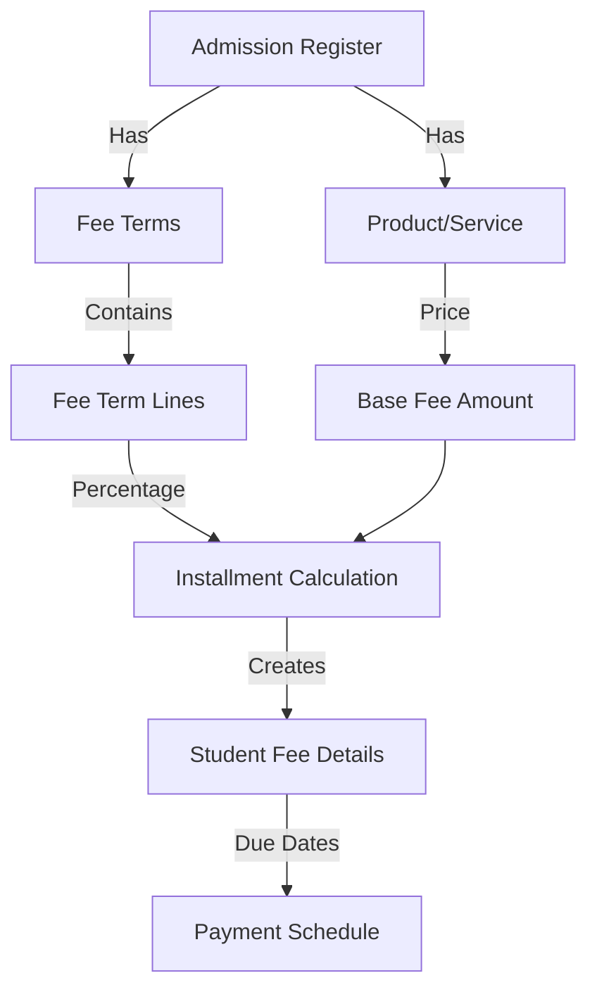
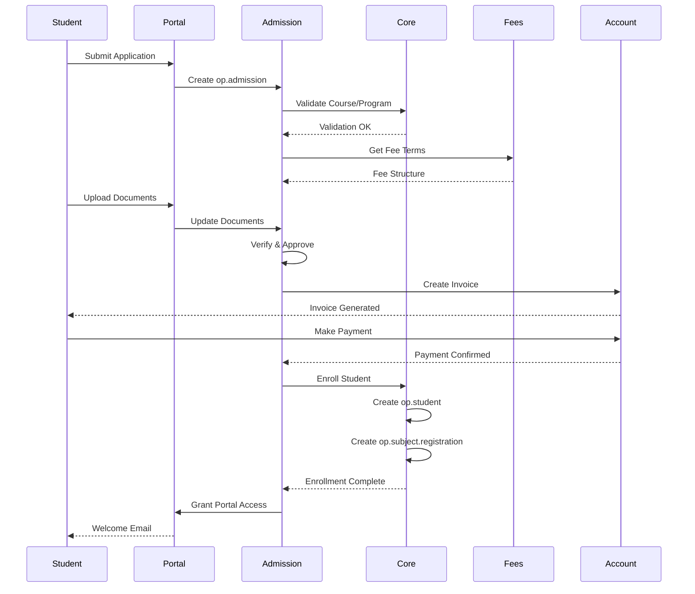

# Module Relationships Documentation

## Overview

This document details how the `openeducat_admission` module integrates with other Odoo modules, explaining dependencies, data flows, and integration points. Understanding these relationships is crucial for proper configuration, customization, and troubleshooting.

---

## Table of Contents

1. [Module Dependency Tree](#module-dependency-tree)
2. [Core Dependencies](#core-dependencies)
3. [Optional Integrations](#optional-integrations)
4. [Odoo Standard Modules](#odoo-standard-modules)
5. [Data Flow Between Modules](#data-flow-between-modules)
6. [Integration Points](#integration-points)
7. [Extension Modules](#extension-modules)
8. [API Integration](#api-integration)

---

## Module Dependency Tree

### Visual Dependency Hierarchy

```
openeducat_admission (v18.0.1.0)
│
├── openeducat_core (Required) ★★★
│   ├── Models Used:
│   │   ├── op.student
│   │   ├── op.course
│   │   ├── op.batch
│   │   ├── op.program
│   │   ├── op.academic.year
│   │   ├── op.academic.term
│   │   └── op.subject.registration
│   │
│   └── Depends On:
│       ├── base
│       ├── mail
│       └── portal
│
├── openeducat_fees (Required) ★★★
│   ├── Models Used:
│   │   ├── op.fees.terms
│   │   ├── op.fees.terms.line
│   │   └── product.product
│   │
│   └── Depends On:
│       ├── openeducat_core
│       └── account
│
└── Standard Odoo Modules
    ├── base (Core framework)
    ├── mail (Chatter, notifications)
    ├── portal (Portal access)
    └── account (Invoicing)
```

**Legend:**
- ★★★ = Critical dependency (required)
- ★★ = Important dependency (recommended)
- ★ = Optional dependency (enhances functionality)

---

## Core Dependencies

### 1. openeducat_core Module

**Dependency Level**: ★★★ Critical (Required)

#### Purpose
Provides the foundational educational management functionality including student, course, program, and batch management.

#### Models Used by Admission Module

##### 1.1 op.student
**Usage**: Target model for admission enrollment

```python
# In op.admission model
student_id = fields.Many2one('op.student', 'Student')

# Creating student from admission
def enroll_student(self):
    vals = self.get_student_vals()
    self.student_id = self.env['op.student'].create(vals)
```

**Data Flow:**
```
Admission → Enrollment → Student Record Created
```

**Fields Mapped:**
| Admission Field | Student Field | Notes |
|----------------|---------------|-------|
| name | name | Full name |
| first_name | first_name | Given name |
| middle_name | middle_name | Middle name |
| last_name | last_name | Surname |
| birth_date | birth_date | Date of birth |
| gender | gender | M/F |
| email | email | Contact email |
| phone | phone | Phone number |
| mobile | mobile | Mobile number |
| image | image_1920 | Profile photo |
| partner_id | partner_id | Related contact |

##### 1.2 op.course
**Usage**: Course selection in admission

```python
course_id = fields.Many2one('op.course', 'Course', required=False)
```

**Integration Points:**
- Course selection in admission form
- Fee calculation based on course
- Batch assignment based on course
- Program determination from course

**Constraints:**
- Course must be active
- Course must belong to selected program
- Course must be available in admission register

##### 1.3 op.batch
**Usage**: Batch assignment for admitted students

```python
batch_id = fields.Many2one('op.batch', 'Batch', required=False)
```

**Integration:**
- Batch selection filtered by course
- Batch capacity checking
- Timetable assignment via batch

##### 1.4 op.program
**Usage**: Program-based admissions

```python
program_id = fields.Many2one('op.program', string="Program", tracking=True)
```

**Features:**
- Program-based admission registers
- Multiple courses under one program
- Program-specific fee structures

##### 1.5 op.academic.year & op.academic.term
**Usage**: Academic period tracking

```python
# In op.admission.register
academic_years_id = fields.Many2one('op.academic.year', 'Academic Year')
academic_term_id = fields.Many2one('op.academic.term', 'Terms')
```

**Purpose:**
- Track admission cycles by academic period
- Link student enrollment to specific term
- Historical data organization

##### 1.6 op.subject.registration
**Usage**: Auto-register subjects on enrollment

```python
def enroll_student(self):
    # After creating student
    reg_id = self.env['op.subject.registration'].create({
        'student_id': student_id,
        'batch_id': self.batch_id.id,
        'course_id': self.course_id.id,
        'min_unit_load': self.course_id.min_unit_load,
        'max_unit_load': self.course_id.max_unit_load,
        'state': 'draft',
    })
    reg_id.get_subjects()
```

**Flow:**
```
Admission Enrollment → Subject Registration Created → Subjects Auto-assigned
```

#### Data Dependencies

**Required Data from openeducat_core:**
- At least one Program must exist
- At least one Course must exist
- At least one Batch must exist
- Academic Year must be configured
- Academic Term must be configured

**Installation Order:**
1. Install `openeducat_core` first
2. Configure basic data (programs, courses, batches)
3. Install `openeducat_admission`

---

### 2. openeducat_fees Module

**Dependency Level**: ★★★ Critical (Required)

#### Purpose
Manages fee calculation, payment terms, and financial transactions related to admissions.

#### Models Used by Admission Module

##### 2.1 op.fees.terms
**Usage**: Fee payment schedule configuration

```python
fees_term_id = fields.Many2one('op.fees.terms', 'Fees Term')
```

**Integration:**
- Define payment schedule (monthly, quarterly, annual)
- Calculate installment amounts
- Set due dates for payments

**Fee Term Types:**
- `fixed_days`: Installments based on days from start
- `fixed_date`: Installments on specific dates

##### 2.2 op.fees.terms.line
**Usage**: Individual installment configuration

```python
# Auto-create fee details on enrollment
for line in self.fees_term_id.line_ids:
    amount = (line.value * self.fees) / 100
    fee_detail = {
        'fees_line_id': line.id,
        'amount': amount,
        'fees_factor': line.value,  # Percentage
        'due_days': line.due_days,
        'due_date': line.due_date,
    }
```

**Calculation Logic:**
```
Total Fee = Admission Fee (from product)
Installment Amount = (Line Percentage × Total Fee) / 100
Due Date = Start Date + Due Days
```

##### 2.3 product.product
**Usage**: Fee product/service definition

```python
# In op.admission.register
product_id = fields.Many2one(
    'product.product', 
    'Course Fees',
    domain=[('type', '=', 'service')]
)

# Fee amount from product
self.fees = self.register_id.product_id.lst_price
```

**Product Configuration:**
- Type: Service
- Sales Price: Fee amount
- Income Account: For accounting integration

#### Fee Calculation Flow



#### Integration with Accounting

```python
def create_invoice(self):
    """Create invoice for admission fee"""
    account_id = self.register_id.product_id.property_account_income_id.id
    
    invoice = self.env['account.invoice'].create({
        'partner_id': self.partner_id.id,
        'move_type': 'out_invoice',
        'invoice_line_ids': [(0, 0, {
            'product_id': self.register_id.product_id.id,
            'price_unit': self.fees,
            'quantity': 1.0,
        })],
    })
```

#### Fee Discount Support

```python
discount = fields.Float(string='Discount (%)', default=0.0)

# Applied during fee detail creation
'discount': self.discount or self.fees_term_id.discount,
```

---

## Optional Integrations

### 3. openeducat_exam Module

**Dependency Level**: ★ Optional

#### Purpose
Link admission to entrance examinations

#### Potential Integration

```python
# Extended admission model
class OpAdmission(models.Model):
    _inherit = 'op.admission'
    
    entrance_exam_id = fields.Many2one('op.exam', 'Entrance Exam')
    exam_score = fields.Float('Exam Score')
    exam_result = fields.Selection([
        ('pass', 'Pass'),
        ('fail', 'Fail')
    ], 'Exam Result')
    
    @api.constrains('exam_result')
    def _check_exam_eligibility(self):
        if self.entrance_exam_id and self.exam_result == 'fail':
            raise ValidationError("Cannot admit student who failed entrance exam")
```

**Use Cases:**
- Entrance exam requirement
- Merit-based admission
- Exam score tracking
- Automatic eligibility checking

---

### 4. openeducat_library Module

**Dependency Level**: ★ Optional

#### Purpose
Auto-create library card on admission

#### Integration Example

```python
def enroll_student(self):
    super().enroll_student()
    
    # Create library card
    if self.student_id:
        self.env['op.library.card'].create({
            'student_id': self.student_id.id,
            'issue_date': fields.Date.today(),
            'valid_until': fields.Date.today() + relativedelta(years=1),
        })
```

---

### 5. openeducat_parent Module

**Dependency Level**: ★ Optional

#### Purpose
Link parent/guardian to admission

#### Integration

```python
class OpAdmission(models.Model):
    _inherit = 'op.admission'
    
    parent_ids = fields.Many2many('op.parent', string='Parents/Guardians')
    
    def enroll_student(self):
        vals = super().get_student_vals()
        vals['parent_ids'] = [(6, 0, self.parent_ids.ids)]
        return vals
```

---

### 6. openeducat_timetable Module

**Dependency Level**: ★ Optional

#### Purpose
Assign student to class schedule on enrollment

#### Integration

```python
def enroll_student(self):
    super().enroll_student()
    
    # Find timetable for batch
    timetable = self.env['op.timetable'].search([
        ('batch_id', '=', self.batch_id.id),
        ('course_id', '=', self.course_id.id),
    ], limit=1)
    
    if timetable:
        self.student_id.timetable_id = timetable.id
```

---

## Odoo Standard Modules

### 7. base Module

**Dependency Level**: ★★★ Critical (Automatic)

#### Models Used

##### 7.1 res.partner
**Usage**: Contact/partner management

```python
partner_id = fields.Many2one('res.partner', 'Partner')

# Partner creation
partner = self.env['res.partner'].create({
    'name': self.name,
    'email': self.email,
    'phone': self.phone,
})
```

**Purpose:**
- Store contact information
- Link to accounting (invoices)
- Portal user association

##### 7.2 res.users
**Usage**: Portal user creation

```python
student_user = self.env['res.users'].create({
    'name': student.name,
    'login': student.email,
    'is_student': True,
    'groups_id': [(6, 0, [self.env.ref('base.group_portal').id])]
})
```

##### 7.3 res.country & res.country.state
**Usage**: Address management

```python
country_id = fields.Many2one('res.country', 'Country')
state_id = fields.Many2one('res.country.state', 'States')
```

##### 7.4 res.company
**Usage**: Multi-company support

```python
company_id = fields.Many2one(
    'res.company', 
    string='Company',
    default=lambda self: self.env.user.company_id
)
```

---

### 8. mail Module

**Dependency Level**: ★★★ Critical (Automatic)

#### Features Used

##### 8.1 Chatter Integration

```python
class OpAdmission(models.Model):
    _inherit = ['mail.thread', 'mail.activity.mixin']
```

**Provides:**
- Message posting
- Activity scheduling
- Follower management
- Email notifications

##### 8.2 Tracking

```python
state = fields.Selection(..., tracking=True)
program_id = fields.Many2one(..., tracking=True)
```

**Benefits:**
- Audit trail
- Change history
- Notification on changes

##### 8.3 Email Templates

```xml
<record id="email_template_admission_confirm" model="mail.template">
    <field name="name">Admission Confirmation</field>
    <field name="model_id" ref="model_op_admission"/>
    <field name="subject">Your Admission is Confirmed</field>
    <field name="body_html">...</field>
</record>
```

---

### 9. portal Module

**Dependency Level**: ★★★ Critical (Automatic)

#### Features

##### 9.1 Portal Access

```python
# Grant portal access
self.env['res.users'].create({
    'groups_id': [(6, 0, [self.env.ref('base.group_portal').id])]
})
```

##### 9.2 Portal Controllers

See [Portal Integration Documentation](05_PORTAL_INTEGRATION.md)

##### 9.3 Portal Views

```xml
<template id="portal_my_admissions" name="My Admissions">
    <t t-call="portal.portal_layout">
        <!-- Portal content -->
    </t>
</template>
```

---

### 10. account Module

**Dependency Level**: ★★ Important (via openeducat_fees)

#### Integration

##### 10.1 Invoice Generation

```python
def create_invoice(self):
    invoice = self.env['account.invoice'].create({
        'partner_id': self.partner_id.id,
        'move_type': 'out_invoice',
        'invoice_line_ids': [...],
    })
```

##### 10.2 Payment Processing

```python
# Payment reconciliation
payment = self.env['account.payment'].create({
    'partner_id': self.partner_id.id,
    'amount': self.fees,
    'payment_type': 'inbound',
})
```

---

## Data Flow Between Modules

### Complete Admission to Enrollment Flow



### Data Synchronization

#### Admission → Student

```python
def get_student_vals(self):
    """Prepare student data from admission"""
    return {
        # Personal Info (from admission)
        'name': self.name,
        'email': self.email,
        'phone': self.phone,
        
        # Course Info (from openeducat_core)
        'course_detail_ids': [[0, False, {
            'course_id': self.course_id.id,
            'batch_id': self.batch_id.id,
            'academic_years_id': self.register_id.academic_years_id.id,
        }]],
        
        # Fee Info (from openeducat_fees)
        'fees_detail_ids': [...],
    }
```

---

## Integration Points

### API Endpoints

#### 1. Admission Creation

```python
# External system creates admission
admission = request.env['op.admission'].sudo().create({
    'name': 'John Doe',
    'email': 'john@example.com',
    'register_id': register_id,
    'course_id': course_id,
})
```

#### 2. Status Check

```python
# Check admission status
admission = request.env['op.admission'].sudo().search([
    ('application_number', '=', app_number)
])
status = admission.state
```

#### 3. Document Upload

```python
# Upload document via API
document = request.env['op.admission.document'].sudo().create({
    'admission_id': admission_id,
    'document': base64_encoded_file,
    'document_type_id': doc_type_id,
})
```

---

## Extension Modules

### Creating Extension Module

```python
# __manifest__.py
{
    'name': 'Admission Extension',
    'depends': ['openeducat_admission'],
}

# models/admission.py
from odoo import models, fields

class OpAdmissionExtend(models.Model):
    _inherit = 'op.admission'
    
    custom_field = fields.Char('Custom Field')
    
    def custom_method(self):
        # Custom logic
        pass
```

---

## Module Interaction Matrix

| Module | Reads From | Writes To | Triggers |
|--------|-----------|-----------|----------|
| **openeducat_admission** | Core, Fees | Core, Account | Student creation, Invoice |
| **openeducat_core** | Base | Base, Mail | User creation |
| **openeducat_fees** | Core, Account | Account | Invoice lines |
| **portal** | Admission | Admission | Application submission |
| **mail** | All | All | Notifications |

---

## Best Practices

### 1. Module Installation Order

```bash
1. base (automatic)
2. mail (automatic)
3. portal (automatic)
4. account
5. openeducat_core
6. openeducat_fees
7. openeducat_admission
8. Optional modules (exam, library, etc.)
```

### 2. Data Migration

When migrating data, follow this order:
1. Partners (res.partner)
2. Programs (op.program)
3. Courses (op.course)
4. Batches (op.batch)
5. Products (product.product)
6. Fee Terms (op.fees.terms)
7. Admission Registers (op.admission.register)
8. Admissions (op.admission)

### 3. Avoiding Circular Dependencies

❌ **Don't:**
```python
# In openeducat_core
class OpStudent(models.Model):
    admission_id = fields.Many2one('op.admission')  # Creates circular dependency
```

✅ **Do:**
```python
# In openeducat_admission
class OpAdmission(models.Model):
    student_id = fields.Many2one('op.student')  # Correct direction
```

---

## Troubleshooting Integration Issues

### Issue: Module Won't Install

**Symptoms:**
- Installation fails
- Dependency error

**Solution:**
```bash
# Check dependencies
# Install in correct order
# Update module list
```

### Issue: Data Not Syncing

**Symptoms:**
- Student not created from admission
- Fees not calculated

**Solution:**
- Check module versions compatibility
- Verify data integrity
- Review server logs

### Issue: Portal Not Working

**Symptoms:**
- Portal users can't access admissions
- Access denied errors

**Solution:**
- Check portal access rights
- Verify record rules
- Check partner_id linking

---

## Conclusion

Understanding module relationships is essential for:
- Proper system configuration
- Effective customization
- Troubleshooting issues
- Planning upgrades
- Developing extensions

---

**Last Updated**: November 2, 2025  
**Version**: 1.0

