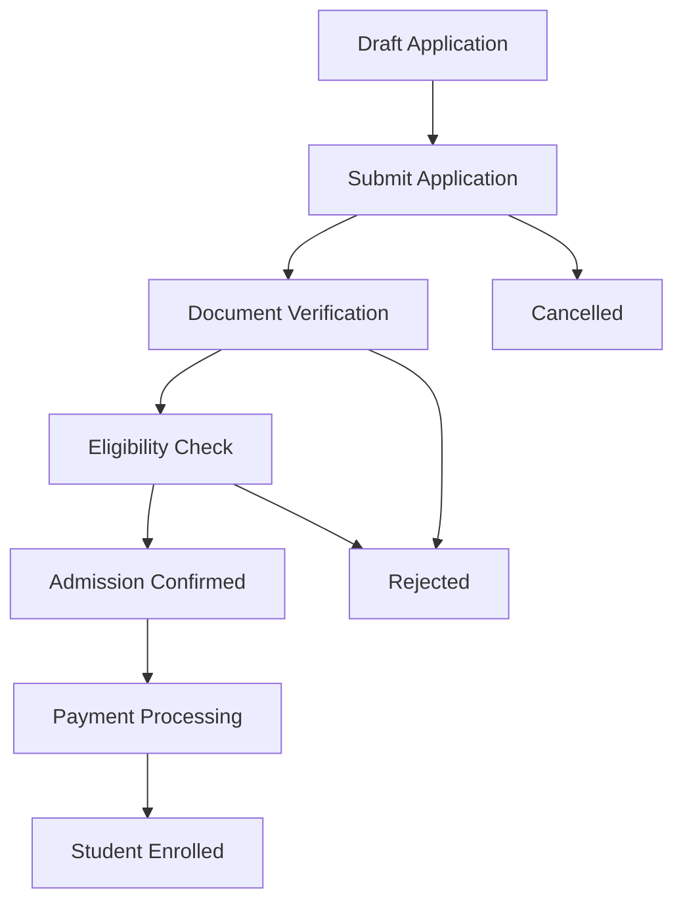

# OpenEduCat Admission Module Documentation

## Welcome to the Admission Module Documentation

This documentation provides comprehensive information about the OpenEduCat Admission module, including technical details, user guides, and integration information.

---

## 📚 Quick Navigation

### For Users
- [Overview](01_OVERVIEW.md) - Module introduction and key features
- [Workflows](04_WORKFLOWS.md) - Understanding admission processes
- [Portal Integration](05_PORTAL_INTEGRATION.md) - How to apply online

### For Administrators
- [Module Relationships](06_MODULE_RELATIONSHIPS.md) - Integration with other modules
- [Security](08_SECURITY.md) - Access control and permissions
- [Reports](09_REPORTS.md) - Analytics and reporting

### For Developers
- [Architecture](02_ARCHITECTURE.md) - Technical architecture overview
- [Models](03_MODELS.md) - Database models and fields
- [Views and UI](07_VIEWS_AND_UI.md) - User interface components
- [API Reference](10_API_REFERENCE.md) - Methods and APIs
- [Customization Guide](11_CUSTOMIZATION_GUIDE.md) - Extending the module
- [Troubleshooting](12_TROUBLESHOOTING.md) - Common issues and solutions

---

## 🚀 Quick Start

### Installation

1. **Prerequisites**
   - Odoo 18.0
   - openeducat_core module
   - openeducat_fees module

2. **Install the Module**
   ```bash
   # Navigate to Odoo Apps
   # Search for "Edafa Admission"
   # Click Install
   ```

3. **Basic Configuration**
   - Navigate to Education → Configuration → Admission
   - Create Admission Register
   - Configure document types
   - Set up fee products

### First Admission

1. Create an Admission Register (campaign)
2. Students apply through portal or manual entry
3. Review and verify documents
4. Approve admission
5. Enroll student

---

## 📖 Module Overview

### What is the Admission Module?

The Admission module manages the complete student admission lifecycle from application submission to enrollment. It provides:

- **Online Application**: Students can apply through web portal
- **Document Management**: Upload and verify required documents
- **Workflow Management**: Structured approval process
- **Fee Integration**: Seamless fee calculation and payment
- **Reporting**: Comprehensive admission analytics

### Key Features

✅ **Multi-channel Applications**
- Online portal applications
- Manual entry by staff
- Bulk import capability

✅ **Document Verification**
- Upload multiple document types
- Track verification status
- Document version control

✅ **Flexible Admission Types**
- Program-based admissions
- Course-based admissions
- Batch management

✅ **Automated Workflows**
- State-based processing
- Email notifications
- Eligibility checking

✅ **Comprehensive Reporting**
- Admission analytics
- Document status reports
- Payment tracking

---

## 🔗 Module Relationships

### Core Dependencies

```
openeducat_admission
├── openeducat_core (Required)
│   ├── Student management
│   ├── Course management
│   └── Program management
└── openeducat_fees (Required)
    ├── Fee calculation
    └── Payment processing
```

### Integration Points

- **Portal**: Online application submission
- **Mail**: Notifications and chatter
- **Account**: Invoice generation
- **Website**: Public admission forms (optional)

---

## 📊 Admission Workflow



### State Descriptions

| State | Description | User Actions |
|-------|-------------|--------------|
| **Draft** | Initial application state | Edit, Submit |
| **Submitted** | Application under review | Review, Verify |
| **Confirmed** | Admission approved | Process payment |
| **Admission** | Ready for enrollment | Enroll student |
| **Done** | Student enrolled | View student record |
| **Rejected** | Application rejected | Archive |
| **Cancelled** | Application cancelled | Archive |

---

## 🌐 Portal Integration

### Student Portal Features

Students can access the portal to:
- Submit online applications
- Upload required documents
- Track application status
- Make fee payments
- Download admission letters

### Portal Access

1. Students receive portal credentials via email
2. Login at: `https://your-domain.com/my/admissions`
3. Complete application form
4. Upload documents
5. Submit application

See [Portal Integration Guide](05_PORTAL_INTEGRATION.md) for details.

---

## 🔐 Security

### Access Control

The module implements role-based access control:

- **Portal User**: Submit and view own applications
- **Admission Officer**: Review and process applications
- **Admission Manager**: Full access and configuration
- **System Administrator**: Complete system access

### Data Privacy

- Students can only view their own applications
- Document access is restricted
- Audit logs track all changes
- GDPR compliance features

See [Security Documentation](08_SECURITY.md) for details.

---

## 📈 Reporting & Analytics

### Available Reports

1. **Admission Analysis Report**
   - Applications by status
   - Program/course distribution
   - Time-series analysis

2. **Document Status Report**
   - Verification progress
   - Pending documents

3. **Payment Collection Report**
   - Fee collection status
   - Payment tracking

See [Reports Documentation](09_REPORTS.md) for details.

---

## 🛠️ Customization

The module is designed to be easily customizable:

- Extend models with custom fields
- Add custom workflows
- Create custom reports
- Integrate with external systems

See [Customization Guide](11_CUSTOMIZATION_GUIDE.md) for details.

---

## 📞 Support & Resources

### Documentation
- Technical Documentation: See individual documentation files
- API Reference: [API Reference](10_API_REFERENCE.md)
- Troubleshooting: [Troubleshooting Guide](12_TROUBLESHOOTING.md)

### Community
- OpenEduCat Community Forum
- GitHub Issues
- Odoo Community

### Commercial Support
- Edafa Inc: https://www.edafa.org
- Email: support@edafa.org

---

## 📝 Version Information

- **Module Version**: 18.0.1.0
- **Odoo Version**: 18.0
- **License**: LGPL-3
- **Author**: Edafa Inc

---

## 🔄 Recent Updates

### Version 18.0.1.0
- Initial Odoo 18 release
- Enhanced workflow management
- Improved portal integration
- Updated security model

---

## 📋 Glossary

| Term | Definition |
|------|------------|
| **Admission Register** | A campaign or period for collecting applications |
| **Applicant** | Person submitting an admission application |
| **Portal User** | Student with web portal access |
| **Enrollment** | Process of converting admission to student record |
| **Fee Terms** | Payment schedule configuration |

---

## 🗺️ Documentation Map

```
doc/
├── README.md (You are here)
├── 01_OVERVIEW.md - Module overview and features
├── 02_ARCHITECTURE.md - Technical architecture
├── 03_MODELS.md - Database models
├── 04_WORKFLOWS.md - Process workflows
├── 05_PORTAL_INTEGRATION.md - Portal functionality
├── 06_MODULE_RELATIONSHIPS.md - Module dependencies
├── 07_VIEWS_AND_UI.md - User interface
├── 08_SECURITY.md - Security and access control
├── 09_REPORTS.md - Reporting capabilities
├── 10_API_REFERENCE.md - API documentation
├── 11_CUSTOMIZATION_GUIDE.md - Customization guide
├── 12_TROUBLESHOOTING.md - Troubleshooting
├── diagrams/ - Visual diagrams
└── screenshots/ - UI screenshots
```

---

## 🤝 Contributing

We welcome contributions! Please see our contribution guidelines for:
- Code standards
- Testing requirements
- Documentation updates
- Pull request process

---

## 📄 License

This module is licensed under LGPL-3. See LICENSE file for details.

---

**Last Updated**: November 2, 2025  
**Maintained By**: Edafa Inc  
**Documentation Version**: 1.0

