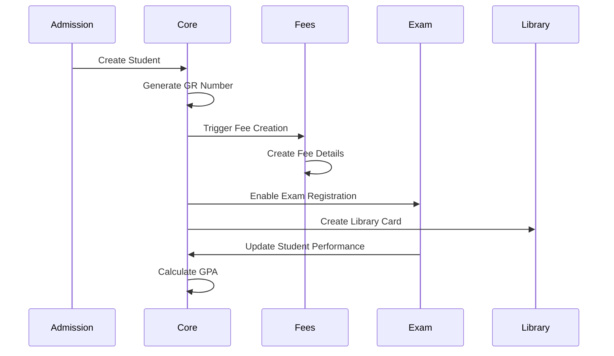
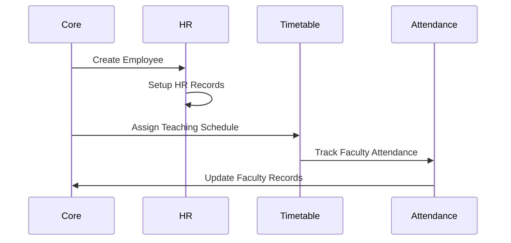

# Module Relationships Documentation

## Overview

This document details how the `openeducat_core` module integrates with other Odoo modules, explaining dependencies, data flows, and integration points. As the foundation module, Core provides essential functionality used by all other OpenEduCat modules.

---

## Table of Contents

1. [Module Dependency Tree](#module-dependency-tree)
2. [Core Dependencies](#core-dependencies)
3. [Modules That Extend Core](#modules-that-extend-core)
4. [Odoo Standard Modules](#odoo-standard-modules)
5. [Data Flow Between Modules](#data-flow-between-modules)
6. [Integration Points](#integration-points)
7. [Extension Patterns](#extension-patterns)

---

## Module Dependency Tree

### Visual Dependency Hierarchy

```
openeducat_core (v18.0.1.0) - FOUNDATION MODULE
│
├── Standard Odoo Modules (Required) ★★★
│   ├── board - Dashboard functionality
│   ├── hr - Human resources integration
│   ├── web - Web interface
│   └── website - Public website features
│
└── Extended By (Optional)
    ├── openeducat_admission ★★★
    ├── openeducat_fees ★★★
    ├── openeducat_exam ★★
    ├── openeducat_library ★★
    ├── openeducat_timetable ★★
    ├── openeducat_attendance ★★
    ├── openeducat_assignment ★★
    ├── openeducat_parent ★
    ├── openeducat_classroom ★
    └── openeducat_facility ★
```

**Legend:**
- ★★★ = Critical extension (highly recommended)
- ★★ = Important extension (recommended)
- ★ = Optional extension (enhances functionality)

---

## Core Dependencies

### 1. board Module

**Dependency Level**: ★★★ Critical (Required)

#### Purpose
Provides dashboard functionality for displaying key metrics and widgets.

#### Usage in Core
- Dashboard views for education management
- KPI widgets
- Quick access panels

#### Integration Points
```xml
<!-- Dashboard definition -->
<record id="open_board_education" model="ir.actions.act_window">
    <field name="name">Education Dashboard</field>
    <field name="res_model">board.board</field>
    <field name="view_mode">form</field>
</record>
```

---

### 2. hr Module

**Dependency Level**: ★★★ Critical (Required)

#### Purpose
Human resources management for faculty-employee integration.

#### Models Used

##### 2.1 hr.employee
**Usage**: Link faculty members to HR employee records

```python
class OpFaculty(models.Model):
    _inherit = 'op.faculty'
    
    employee_id = fields.Many2one('hr.employee', 'Employee')
    
    def create_employee(self):
        """Create HR employee record for faculty"""
        for record in self:
            if not record.employee_id:
                employee = self.env['hr.employee'].create({
                    'name': record.name,
                    'work_email': record.email,
                    'work_phone': record.phone,
                    'department_id': record.department_id.id,
                })
                record.employee_id = employee.id
```

#### Data Flow
```
Faculty Record → Create Employee → HR System
```

#### Benefits
- Centralized employee management
- Leave management integration
- Payroll integration
- Attendance tracking
- Performance management

---

### 3. web Module

**Dependency Level**: ★★★ Critical (Required)

#### Purpose
Core web interface and backend functionality.

#### Features Used
- Form views
- List views
- Kanban views
- Search views
- Actions
- Menus
- Assets (JS/CSS)

#### Custom Widgets
```javascript
// Custom inline char widget
odoo.define('openeducat_core.field_inline_char', function (require) {
    "use strict";
    
    var FieldChar = require('web.basic_fields').FieldChar;
    var fieldRegistry = require('web.field_registry');
    
    var FieldInlineChar = FieldChar.extend({
        // Custom widget implementation
    });
    
    fieldRegistry.add('inline_char', FieldInlineChar);
});
```

---

### 4. website Module

**Dependency Level**: ★★★ Critical (Required)

#### Purpose
Public-facing website features and portal functionality.

#### Features Used
- Portal access
- Public pages
- Student/faculty portals
- Website assets
- Controllers

#### Portal Controllers
```python
from odoo import http
from odoo.addons.portal.controllers.portal import CustomerPortal

class EducationPortal(CustomerPortal):
    
    @http.route(['/my/student/dashboard'], type='http', auth="user", website=True)
    def student_dashboard(self, **kw):
        """Student portal dashboard"""
        student = request.env['op.student'].search([
            ('user_id', '=', request.env.user.id)
        ], limit=1)
        
        values = {
            'student': student,
            'page_name': 'student_dashboard',
        }
        
        return request.render("openeducat_core.portal_student_dashboard", values)
```

---

## Modules That Extend Core

### 1. openeducat_admission

**Dependency**: openeducat_core, openeducat_fees  
**Priority**: ★★★ Critical

#### Purpose
Manages the admission process from application to enrollment.

#### Uses from Core
- **op.student**: Creates student records from admissions
- **op.course**: Course selection in applications
- **op.batch**: Batch assignment
- **op.program**: Program-based admissions
- **op.academic.year**: Academic year tracking
- **op.academic.term**: Term tracking

#### Data Flow
```
Admission Application → Approval → Student Record Created (Core)
```

#### Integration Example
```python
class OpAdmission(models.Model):
    _name = 'op.admission'
    
    def enroll_student(self):
        """Create student record from admission"""
        vals = self.get_student_vals()
        self.student_id = self.env['op.student'].create(vals)
```

See [Admission Module Documentation](../../openeducat_admission/static/doc/README.md)

---

### 2. openeducat_fees

**Dependency**: openeducat_core  
**Priority**: ★★★ Critical

#### Purpose
Fee management, payment processing, and financial tracking.

#### Uses from Core
- **op.student**: Fee assignment to students
- **op.course**: Course-based fee structure
- **op.batch**: Batch-wise fee management
- **op.academic.year**: Year-wise fee tracking
- **op.academic.term**: Term-wise fee tracking

#### Integration Example
```python
class OpFeesDetails(models.Model):
    _name = 'op.fees.details'
    
    student_id = fields.Many2one('op.student', 'Student', required=True)
    course_id = fields.Many2one('op.course', 'Course')
    batch_id = fields.Many2one('op.batch', 'Batch')
```

---

### 3. openeducat_exam

**Dependency**: openeducat_core  
**Priority**: ★★ Important

#### Purpose
Examination management, grade entry, and result processing.

#### Uses from Core
- **op.student**: Student exam registration
- **op.course**: Course exams
- **op.batch**: Batch-wise exams
- **op.subject**: Subject exams
- **op.faculty**: Exam supervisors

#### Integration Example
```python
class OpExam(models.Model):
    _name = 'op.exam'
    
    course_id = fields.Many2one('op.course', 'Course', required=True)
    batch_id = fields.Many2one('op.batch', 'Batch', required=True)
    subject_id = fields.Many2one('op.subject', 'Subject', required=True)
    
class OpExamLine(models.Model):
    _name = 'op.exam.line'
    
    student_id = fields.Many2one('op.student', 'Student', required=True)
    marks = fields.Float('Marks')
```

---

### 4. openeducat_library

**Dependency**: openeducat_core  
**Priority**: ★★ Important

#### Purpose
Library management, book circulation, and tracking.

#### Uses from Core
- **op.student**: Library card issuance
- **op.faculty**: Faculty library access
- **op.course**: Course-related books

#### Integration Example
```python
class OpLibraryCard(models.Model):
    _name = 'op.library.card'
    
    student_id = fields.Many2one('op.student', 'Student')
    faculty_id = fields.Many2one('op.faculty', 'Faculty')
```

---

### 5. openeducat_timetable

**Dependency**: openeducat_core  
**Priority**: ★★ Important

#### Purpose
Timetable/schedule management for classes.

#### Uses from Core
- **op.course**: Course scheduling
- **op.batch**: Batch timetables
- **op.subject**: Subject scheduling
- **op.faculty**: Faculty teaching schedule

#### Integration Example
```python
class OpTimetable(models.Model):
    _name = 'op.timetable'
    
    course_id = fields.Many2one('op.course', 'Course', required=True)
    batch_id = fields.Many2one('op.batch', 'Batch', required=True)
    subject_id = fields.Many2one('op.subject', 'Subject', required=True)
    faculty_id = fields.Many2one('op.faculty', 'Faculty', required=True)
```

---

### 6. openeducat_attendance

**Dependency**: openeducat_core  
**Priority**: ★★ Important

#### Purpose
Student and faculty attendance tracking.

#### Uses from Core
- **op.student**: Student attendance
- **op.faculty**: Faculty attendance
- **op.course**: Course-wise attendance
- **op.batch**: Batch attendance
- **op.subject**: Subject attendance

#### Integration Example
```python
class OpAttendance(models.Model):
    _name = 'op.attendance'
    
    student_id = fields.Many2one('op.student', 'Student', required=True)
    course_id = fields.Many2one('op.course', 'Course')
    batch_id = fields.Many2one('op.batch', 'Batch')
    subject_id = fields.Many2one('op.subject', 'Subject')
    state = fields.Selection([
        ('present', 'Present'),
        ('absent', 'Absent'),
        ('late', 'Late')
    ], 'Status')
```

---

### 7. openeducat_assignment

**Dependency**: openeducat_core  
**Priority**: ★★ Important

#### Purpose
Assignment management and submission tracking.

#### Uses from Core
- **op.student**: Assignment submissions
- **op.faculty**: Assignment creation
- **op.course**: Course assignments
- **op.batch**: Batch assignments
- **op.subject**: Subject assignments

---

### 8. openeducat_parent

**Dependency**: openeducat_core  
**Priority**: ★ Optional

#### Purpose
Parent/guardian management and portal access.

#### Uses from Core
- **op.student**: Parent-student relationships

#### Integration Example
```python
class OpParent(models.Model):
    _name = 'op.parent'
    
    student_ids = fields.Many2many('op.student', string='Children')
```

---

## Odoo Standard Modules

### 1. base Module

**Dependency Level**: ★★★ Critical (Automatic)

#### Models Used

##### 1.1 res.partner
**Usage**: Contact/partner management for students and faculty

```python
class OpStudent(models.Model):
    _inherits = {"res.partner": "partner_id"}
    
    partner_id = fields.Many2one('res.partner', 'Partner', required=True)
```

**Inherited Fields:**
- name, email, phone, mobile
- street, street2, city, zip
- country_id, state_id
- image_1920
- company_id

##### 1.2 res.users
**Usage**: User account management

```python
class OpStudent(models.Model):
    user_id = fields.Many2one('res.users', 'User')
    
    def create_student_user(self):
        user = self.env['res.users'].create({
            'name': self.name,
            'login': self.email,
            'partner_id': self.partner_id.id,
            'groups_id': [(6, 0, [self.env.ref('base.group_portal').id])],
        })
        self.user_id = user.id
```

##### 1.3 res.country & res.country.state
**Usage**: Address management

```python
nationality = fields.Many2one('res.country', 'Nationality')
state_id = fields.Many2one('res.country.state', 'State')
```

##### 1.4 res.company
**Usage**: Multi-company support

```python
company_id = fields.Many2one(
    'res.company',
    'Company',
    default=lambda self: self.env.user.company_id
)
```

---

### 2. mail Module

**Dependency Level**: ★★★ Critical (Automatic)

#### Features Used

##### 2.1 Chatter Integration
```python
class OpStudent(models.Model):
    _inherit = ['mail.thread', 'mail.activity.mixin']
```

**Provides:**
- Message posting
- Activity scheduling
- Follower management
- Email notifications
- Document tracking

##### 2.2 Tracking
```python
course_detail_ids = fields.One2many(..., tracking=True)
```

---

### 3. portal Module

**Dependency Level**: ★★★ Critical (Automatic)

#### Features

##### 3.1 Portal Access
```python
# Student portal group
<record id="group_op_student" model="res.groups">
    <field name="name">Student Portal</field>
    <field name="implied_ids" eval="[(4, ref('base.group_portal'))]"/>
</record>

# Faculty portal group
<record id="group_op_faculty" model="res.groups">
    <field name="name">Faculty Portal</field>
    <field name="implied_ids" eval="[(4, ref('base.group_portal'))]"/>
</record>
```

##### 3.2 Portal Controllers
```python
class StudentPortal(CustomerPortal):
    @http.route(['/my/student/dashboard'], type='http', auth="user", website=True)
    def student_dashboard(self, **kw):
        # Portal dashboard implementation
        pass
```

---

## Data Flow Between Modules

### Complete Student Lifecycle Flow



### Faculty Integration Flow



---

## Integration Points

### API Endpoints

#### 1. Student Management
```python
# Create student via API
student = request.env['op.student'].sudo().create({
    'first_name': 'John',
    'last_name': 'Doe',
    'email': 'john@example.com',
    'gr_no': 'GR2024001',
})
```

#### 2. Course Enrollment
```python
# Enroll student in course
enrollment = request.env['op.student.course'].sudo().create({
    'student_id': student.id,
    'course_id': course.id,
    'batch_id': batch.id,
})
```

#### 3. Faculty Assignment
```python
# Assign faculty to course
assignment = request.env['op.timetable'].sudo().create({
    'faculty_id': faculty.id,
    'course_id': course.id,
    'batch_id': batch.id,
})
```

---

## Extension Patterns

### 1. Extending Student Model

```python
# In custom module
class OpStudentCustom(models.Model):
    _inherit = 'op.student'
    
    custom_field = fields.Char('Custom Field')
    custom_relation = fields.Many2one('custom.model', 'Custom Relation')
    
    def custom_method(self):
        # Custom logic
        pass
```

### 2. Adding New Relationships

```python
# Link new module to core
class CustomModel(models.Model):
    _name = 'custom.model'
    
    student_id = fields.Many2one('op.student', 'Student')
    course_id = fields.Many2one('op.course', 'Course')
    faculty_id = fields.Many2one('op.faculty', 'Faculty')
```

### 3. Extending Portal

```python
# Add custom portal pages
class CustomPortal(CustomerPortal):
    
    @http.route(['/my/custom/page'], type='http', auth="user", website=True)
    def custom_page(self, **kw):
        student = request.env['op.student'].search([
            ('user_id', '=', request.env.user.id)
        ])
        
        return request.render("custom_module.custom_template", {
            'student': student,
        })
```

---

## Module Interaction Matrix

| Module | Reads From Core | Writes To Core | Triggers |
|--------|----------------|----------------|----------|
| **openeducat_admission** | Student, Course, Batch | Student (create) | Student creation |
| **openeducat_fees** | Student, Course | - | Fee generation |
| **openeducat_exam** | Student, Course, Subject | - | Grade entry |
| **openeducat_library** | Student, Faculty | - | Card issuance |
| **openeducat_timetable** | Course, Batch, Faculty | - | Schedule creation |
| **openeducat_attendance** | Student, Faculty, Course | - | Attendance marking |

---

## Best Practices

### 1. Module Development Order

When developing new modules:
```
1. Install openeducat_core first
2. Set up basic data (programs, courses, etc.)
3. Install extension modules
4. Configure integrations
5. Test data flow
```

### 2. Data Dependencies

Always ensure:
- Academic years exist before creating terms
- Programs exist before creating courses
- Courses exist before creating batches
- Departments exist before assigning faculty

### 3. Avoiding Circular Dependencies

❌ **Don't:**
```python
# In openeducat_core
class OpStudent(models.Model):
    admission_id = fields.Many2one('op.admission')  # Circular!
```

✅ **Do:**
```python
# In openeducat_admission
class OpAdmission(models.Model):
    student_id = fields.Many2one('op.student')  # Correct direction
```

---

## Troubleshooting Integration Issues

### Issue: Module Won't Install

**Symptoms:**
- Installation fails
- Dependency error

**Solution:**
```bash
# Check dependencies
# Install in correct order:
1. openeducat_core
2. openeducat_fees
3. openeducat_admission
4. Other modules
```

### Issue: Data Not Syncing

**Symptoms:**
- Records not appearing in related modules
- Missing relationships

**Solution:**
- Check module installation order
- Verify data integrity
- Review server logs
- Check record rules

---

## Conclusion

The OpenEduCat Core module serves as the foundation for the entire educational management system. Understanding its relationships with other modules is essential for:
- Proper system configuration
- Effective customization
- Troubleshooting issues
- Planning upgrades
- Developing extensions

---

**Last Updated**: November 3, 2025  
**Version**: 1.0

