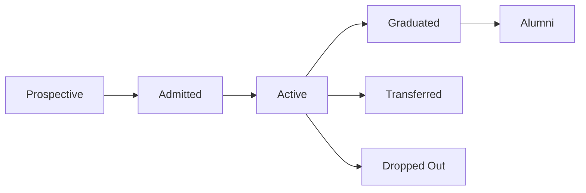
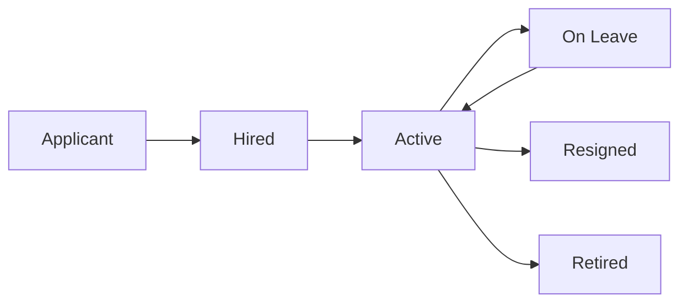
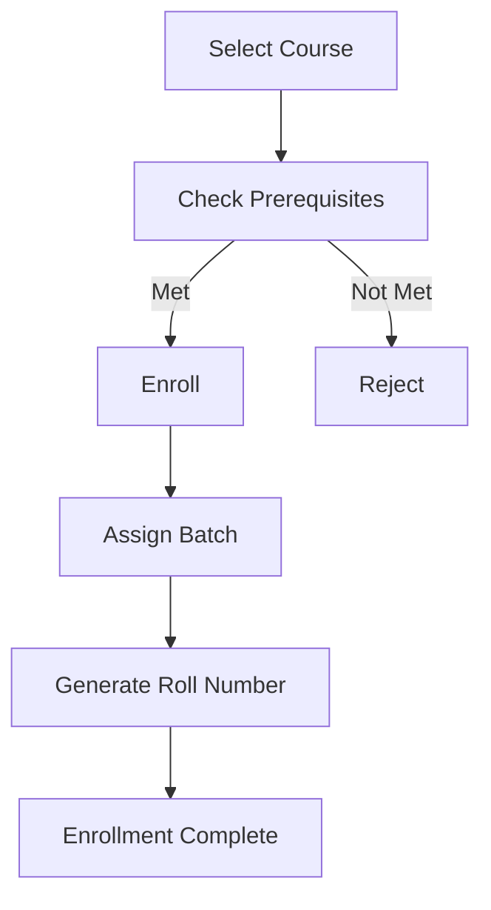

# OpenEduCat Core Module Documentation

## Welcome to the Core Module Documentation

This documentation provides comprehensive information about the OpenEduCat Core module, which serves as the foundation for the entire OpenEduCat educational management system.

---

## 📚 Quick Navigation

### For Users
- [Overview](01_OVERVIEW.md) - Module introduction and key features
- [Workflows](04_WORKFLOWS.md) - Understanding core processes
- [Portal Integration](05_PORTAL_INTEGRATION.md) - Student and faculty portals

### For Administrators
- [Module Relationships](06_MODULE_RELATIONSHIPS.md) - Integration with other modules
- [Security](08_SECURITY.md) - Access control and permissions
- [Reports](09_REPORTS.md) - Analytics and reporting

### For Developers
- [Architecture](02_ARCHITECTURE.md) - Technical architecture overview
- [Models](03_MODELS.md) - Database models and fields
- [Views and UI](07_VIEWS_AND_UI.md) - User interface components
- [API Reference](10_API_REFERENCE.md) - Methods and APIs
- [Customization Guide](11_CUSTOMIZATION_GUIDE.md) - Extending the module
- [Troubleshooting](12_TROUBLESHOOTING.md) - Common issues and solutions

---

## 🚀 Quick Start

### Installation

1. **Prerequisites**
   - Odoo 18.0
   - Python 3.10+
   - PostgreSQL 12+

2. **Install the Module**
   ```bash
   # Navigate to Odoo Apps
   # Search for "Edafa Core"
   # Click Install
   ```

3. **Basic Configuration**
   - Navigate to Education → Configuration
   - Set up Academic Years
   - Create Academic Terms
   - Configure Departments
   - Set up Programs and Courses

### First Steps

1. **Create Academic Structure**
   - Create Academic Year (e.g., 2024-2025)
   - Create Academic Terms (Fall, Spring)
   - Create Departments
   - Create Programs
   - Create Courses
   - Create Batches

2. **Add Students**
   - Navigate to Education → Students
   - Create student records
   - Enroll in courses
   - Assign to batches

3. **Add Faculty**
   - Navigate to Education → Faculty
   - Create faculty records
   - Assign to departments
   - Create user accounts

---

## 📖 Module Overview

### What is the Core Module?

The OpenEduCat Core module is the foundational component of the OpenEduCat educational management system. It provides essential functionality for managing:

- **Students**: Complete student lifecycle management
- **Faculty**: Faculty member management and tracking
- **Courses**: Course catalog and management
- **Programs**: Academic program structure
- **Batches**: Class/section management
- **Subjects**: Subject/course content management
- **Academic Calendar**: Years and terms management
- **Departments**: Organizational structure

### Key Features

✅ **Student Management**
- Comprehensive student profiles
- Course enrollment tracking
- Student portal access
- Document management
- Performance tracking

✅ **Faculty Management**
- Faculty profiles and qualifications
- Department assignments
- User account management
- Portal access

✅ **Academic Structure**
- Programs and courses
- Batches and subjects
- Academic years and terms
- Prerequisites and requirements

✅ **Portal Access**
- Student self-service portal
- Faculty portal
- Mobile-responsive design
- Real-time updates

✅ **Reporting**
- Student reports
- Faculty reports
- Academic reports
- Custom report builder

---

## 🔗 Core Models

### Student Management

#### op.student
Main student model with comprehensive information:
- Personal details (name, DOB, gender)
- Contact information
- Emergency contacts
- Course enrollments
- Academic records
- Portal access

#### op.student.course
Student course enrollment tracking:
- Course assignments
- Batch assignments
- Roll numbers
- Academic year/term
- Enrollment status

### Faculty Management

#### op.faculty
Faculty member information:
- Personal details
- Qualifications
- Department assignment
- Employee integration
- Portal access

### Academic Structure

#### op.program
Academic program definition:
- Program name and code
- Department
- Duration
- Requirements

#### op.course
Course catalog:
- Course name and code
- Program assignment
- Subjects
- Unit load requirements
- Evaluation type

#### op.batch
Class/section management:
- Batch name and code
- Course assignment
- Academic year/term
- Student capacity

#### op.subject
Subject/course content:
- Subject name and code
- Course assignments
- Subject type
- Prerequisites

### Administrative

#### op.department
Organizational departments:
- Department name and code
- Parent department
- Department head

#### op.academic.year
Academic year management:
- Year name and code
- Start and end dates
- Current year flag

#### op.academic.term
Academic term/semester:
- Term name and code
- Academic year
- Start and end dates

#### op.category
Student classification:
- Category name and code
- Description

---

## 🌐 Portal Integration

### Student Portal Features

Students can access the portal to:
- View personal information
- Check course enrollments
- View grades and transcripts
- Download certificates
- Access course materials
- Communicate with faculty
- View announcements

**Portal Access**: `https://your-domain.com/my/student/dashboard`

### Faculty Portal Features

Faculty members can:
- View teaching schedule
- Access student lists
- Mark attendance
- Enter grades
- Upload course materials
- Communicate with students
- View reports

**Portal Access**: `https://your-domain.com/my/faculty/dashboard`

See [Portal Integration Guide](05_PORTAL_INTEGRATION.md) for details.

---

## 🔐 Security

### Access Control

The module implements role-based access control:

- **Portal User (Student)**: View own information, access portal
- **Portal User (Faculty)**: View assigned students, manage courses
- **Education User**: Basic access to education features
- **Education Manager**: Full access to education management
- **System Administrator**: Complete system access

### User Groups

| Group | Access Level | Typical Users |
|-------|-------------|---------------|
| `group_op_student` | Student Portal | Students |
| `group_op_faculty` | Faculty Portal | Faculty Members |
| `group_op_back_office` | Education User | Staff |
| `group_op_back_office_admin` | Education Manager | Administrators |

### Data Privacy

- Students can only view their own records
- Faculty can only view assigned students
- Document access is restricted
- Audit logs track all changes
- GDPR compliance features

See [Security Documentation](08_SECURITY.md) for details.

---

## 📊 Module Relationships

### Core Dependencies

```
openeducat_core
├── board (Odoo Dashboard)
├── hr (Human Resources)
├── web (Web Interface)
└── website (Public Website)
```

### Extended By

The core module is extended by:
- **openeducat_admission**: Admission management
- **openeducat_fees**: Fee management
- **openeducat_exam**: Examination management
- **openeducat_library**: Library management
- **openeducat_timetable**: Timetable management
- **openeducat_attendance**: Attendance tracking
- **openeducat_assignment**: Assignment management

### Integration Points

- **HR Module**: Faculty-employee integration
- **Portal**: Student and faculty portals
- **Mail**: Notifications and chatter
- **Website**: Public-facing features

See [Module Relationships](06_MODULE_RELATIONSHIPS.md) for details.

---

## 📈 Reporting & Analytics

### Available Reports

1. **Student Reports**
   - Student list
   - Bonafide certificate
   - ID card
   - Transcript
   - Enrollment report

2. **Faculty Reports**
   - Faculty list
   - Department-wise faculty
   - Qualification report

3. **Academic Reports**
   - Course enrollment
   - Batch-wise students
   - Program statistics
   - Department statistics

4. **Custom Reports**
   - Report builder
   - Custom filters
   - Export to Excel/PDF

See [Reports Documentation](09_REPORTS.md) for details.

---

## 🛠️ Customization

The module is designed to be easily customizable:

- Extend models with custom fields
- Add custom workflows
- Create custom reports
- Integrate with external systems
- Custom portal pages
- Theme customization

See [Customization Guide](11_CUSTOMIZATION_GUIDE.md) for details.

---

## 📋 Workflows

### Student Lifecycle



### Faculty Lifecycle



### Course Enrollment



See [Workflows Documentation](04_WORKFLOWS.md) for details.

---

## 🎓 User Roles

### Students
- Access personal information
- View course enrollments
- Check grades
- Download certificates
- Access portal features

### Faculty
- View teaching assignments
- Access student information
- Manage courses
- Upload materials
- Generate reports

### Staff (Education User)
- Manage students and faculty
- Process enrollments
- Generate reports
- Handle administrative tasks

### Administrators (Education Manager)
- Full system access
- Configure settings
- Manage users
- System administration

---

## 📞 Support & Resources

### Documentation
- Technical Documentation: See individual documentation files
- API Reference: [API Reference](10_API_REFERENCE.md)
- Troubleshooting: [Troubleshooting Guide](12_TROUBLESHOOTING.md)

### Community
- OpenEduCat Community Forum
- GitHub Issues
- Odoo Community

### Commercial Support
- Edafa Inc: https://www.edafa.org
- Email: support@edafa.org

---

## 📝 Version Information

- **Module Version**: 18.0.1.0
- **Odoo Version**: 18.0
- **License**: LGPL-3
- **Author**: Edafa Inc

---

## 🔄 Recent Updates

### Version 18.0.1.0
- Initial Odoo 18 release
- Enhanced student management
- Improved portal features
- Updated security model
- Performance optimizations

---

## 📋 Glossary

| Term | Definition |
|------|------------|
| **Student** | Person enrolled in educational programs |
| **Faculty** | Teaching staff member |
| **Course** | Academic course or program of study |
| **Batch** | Class or section of students |
| **Subject** | Individual subject within a course |
| **Program** | Academic degree or certification program |
| **Academic Year** | Annual academic period |
| **Academic Term** | Semester or term within academic year |
| **Department** | Organizational unit |
| **Portal User** | User with web portal access |

---

## 🗺️ Documentation Map

```
doc/
├── README.md (You are here)
├── 01_OVERVIEW.md - Module overview
├── 02_ARCHITECTURE.md - Technical architecture
├── 03_MODELS.md - Database models
├── 04_WORKFLOWS.md - Process workflows
├── 05_PORTAL_INTEGRATION.md - Portal functionality
├── 06_MODULE_RELATIONSHIPS.md - Module dependencies
├── 07_VIEWS_AND_UI.md - User interface
├── 08_SECURITY.md - Security and access control
├── 09_REPORTS.md - Reporting capabilities
├── 10_API_REFERENCE.md - API documentation
├── 11_CUSTOMIZATION_GUIDE.md - Customization guide
├── 12_TROUBLESHOOTING.md - Troubleshooting
├── diagrams/ - Visual diagrams
└── screenshots/ - UI screenshots
```

---

## 🤝 Contributing

We welcome contributions! Please see our contribution guidelines for:
- Code standards
- Testing requirements
- Documentation updates
- Pull request process

---

## 📄 License

This module is licensed under LGPL-3. See LICENSE file for details.

---

## 🎯 Quick Links

### Configuration
- Education → Configuration → Academic Years
- Education → Configuration → Academic Terms
- Education → Configuration → Departments
- Education → Configuration → Programs
- Education → Configuration → Categories

### Management
- Education → Students
- Education → Faculty
- Education → Courses
- Education → Batches
- Education → Subjects

### Reports
- Education → Reports → Students
- Education → Reports → Faculty
- Education → Reports → Courses

### Portal
- My Account → Student Dashboard
- My Account → Faculty Dashboard

---

**Last Updated**: November 3, 2025  
**Maintained By**: Edafa Inc  
**Documentation Version**: 1.0

